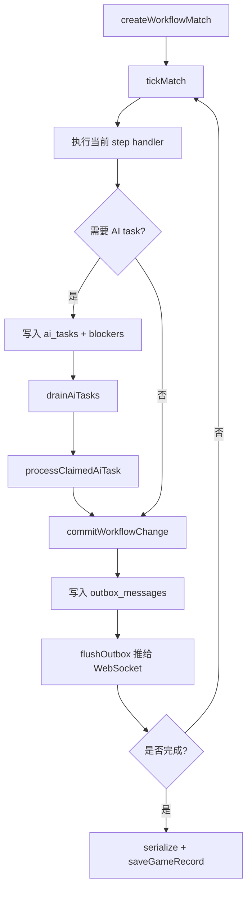

# 核心游戏与工作流

## 核心模块

核心游戏逻辑主要在服务端：

- `packages/server/modules/workflow-engine`：通用工作流引擎。
- `packages/server/modules/debate`：辩论赛流程。
- `packages/server/modules/werewolf`：狼人杀流程。
- `packages/server/modules/agent-core`：AI 玩家、技能注册和执行。
- `packages/server/modules/game-memory`：游戏记忆。
- `packages/server/modules/observability`：AI 调用和游戏事件观测。

前端只展示服务端投影出的游戏状态，不承担最终游戏规则判定。

## workflow-engine

工作流引擎负责把游戏拆成可持久化、可调试、可重放的步骤。

关键文件：

- `workflowRegistry.ts`
  - 注册 workflow。
  - 根据 workflowId 获取 workflow。
  - 根据 step type 获取 handler。
- `service.ts`
  - 创建 match。
  - 推进 tick。
  - 领取和完成 AI task。
  - 提交 pending action。
  - 创建/解决 interrupt。
  - 查询 debug state 和 outbox。
- `tick.ts`
  - 推进当前 match step。
- `repository.ts`
  - 读写 match、event、task、pending action、outbox 等数据。
- `effects.ts`
  - 工作流效果与 interrupt。
- `aiTaskWorker.ts`
  - 执行已领取 AI task。
- `projection.ts`
  - 状态投影。

## 通用工作流状态

一局游戏会对应一个 `match`：

- `matches` 保存当前状态、当前 step、状态版本、blockers、错误。
- `workflow_events` 保存事件流。
- `ai_tasks` 保存 AI 任务。
- `pending_actions` 保存等待提交的行动。
- `outbox_messages` 保存待推送给前端的事件。
- `match_snapshots` 保存状态快照。

基础推进模式：

## 辩论赛流程

目录：`packages/server/modules/debate`

入口：

- `packages/server/aiDebateRunner.ts`
- `packages/server/modules/debate/workflow.ts`

工作流 ID：

- `debate.workflow.v1`

主要步骤：

1. `topic_reveal`：公布辩题。
2. `opening_pro_1`：正方一辩立论。
3. `opening_con_1`：反方一辩立论。
4. `crossfire_*`：多轮攻辩提问/回答。
5. `closing_con_4`：反方四辩总结。
6. `closing_pro_4`：正方四辩总结。
7. `judge_review_*`：评委点评并投胜负。
8. `mvp_vote_*`：选手投最佳辩手。
9. `result_announce`：公布结果。

核心机制：

- `createDebateWorkflowMatch` 创建 match 和初始辩论状态。
- 每个 AI turn 生成 `ai_tasks`。
- `executeSkillWithTrace` 调用对应辩论技能。
- `validateAiResult` 校验 AI 输出，例如点评必须包含胜方和文本，MVP 投票必须投给候选人。
- `applyAiTurnResult` 把 AI 输出写入 phase、speech、winner、mvp。
- `serializeDebateState` 生成前端可展示的对局状态。

辩论赛状态包含：

- `topic`
- `host`
- `players`
- `phases`
- `rounds`
- `winner`
- `winReason`
- `mvp`
- `fallbackAudit`

## 狼人杀流程

目录：`packages/server/modules/werewolf`

入口：

- `packages/server/modules/werewolf/workflow.ts`
- `packages/server/modules/werewolf/runtime.ts`

工作流 ID：

- `werewolf.workflow.basic.v1`

步骤来源：

- `createWerewolfSteps()` 根据 `MAX_DAYS` 生成多天流程。

基础步骤：

1. `assign_roles`：分配身份。
2. 每天夜晚：
   - `night_start`
   - `wolf_speech`
   - `wolf_vote`
   - `seer_check`
   - `guard_protect`
   - `witch_save`
   - `witch_poison`
   - `night_resolve`
3. 每天白天：
   - `day_start`
   - 首日警长竞选流程。
   - `day_speech`
   - `day_vote`
   - `exile_resolve`
   - `check_win`
4. `finalize`：结束游戏。

首日警长流程：

- `sheriff_signup`
- `sheriff_speech`
- `sheriff_withdraw`
- `sheriff_vote`
- `sheriff_runoff_speech`
- `sheriff_runoff_vote`
- `sheriff_resolve`

核心机制：

- `createInitialWerewolfState` 根据狼人杀模式展开角色槽、随机分配角色、创建 agent。
- `createRuntime` 从 match/state 恢复运行时 agent、技能注册和上下文。
- `createWerewolfHandlers` 为不同 step type 提供处理器。
- action window 类型 step 会创建 AI 行动窗口或 pending action。
- 夜间结算、放逐结算、胜负检查由服务端规则处理。
- `serializeWerewolfState` 去掉内部 `roleConfig`，输出前端可展示状态。
- `viewPolicy` 负责按视角投影狼人杀状态，避免普通视角看到不该看到的信息。

狼人杀状态包含：

- `werewolfMode`
- `clientViewMode`
- `host`
- `players`
- `rounds`
- `winner`
- `winReason`
- `currentActionWindow`
- `fallbackAudit`

## AI 玩家与技能

通用 AI 能力在 `agent-core`：

- `playerAgent.ts`：玩家 agent。
- `gameAgent.ts`：游戏 agent。
- `skillRegistry.ts`：技能注册。
- `skillExecutor.ts`：技能执行。
- `roleSkillRegistry.ts`：按角色应用技能。
- `fallbackAudit.ts`：兜底行为审计。

辩论赛和狼人杀分别有自己的角色技能注册：

- `packages/server/modules/debate/skillRegistry.ts`
- `packages/server/modules/debate/roleSkills.ts`
- `packages/server/modules/werewolf/roles.ts`
- `packages/server/modules/werewolf/roleSkills.ts`

## 前端播放与服务端推进

服务端并不是一次性把所有状态推给前端，而是按事件节奏推进：

1. 服务端发送事件。
2. 如果事件需要等待播放，`session.sendAndWait` 注入 `ackId`。
3. 前端更新界面并播放旁白/发言。
4. 前端发送 `ack`。
5. 服务端继续下一步。

这种设计保证：

- 自动播放时节奏可控。
- 回放可以暂停、继续、跳过阶段。
- 服务端不会在前端还没播放完时连续推进大量发言。

