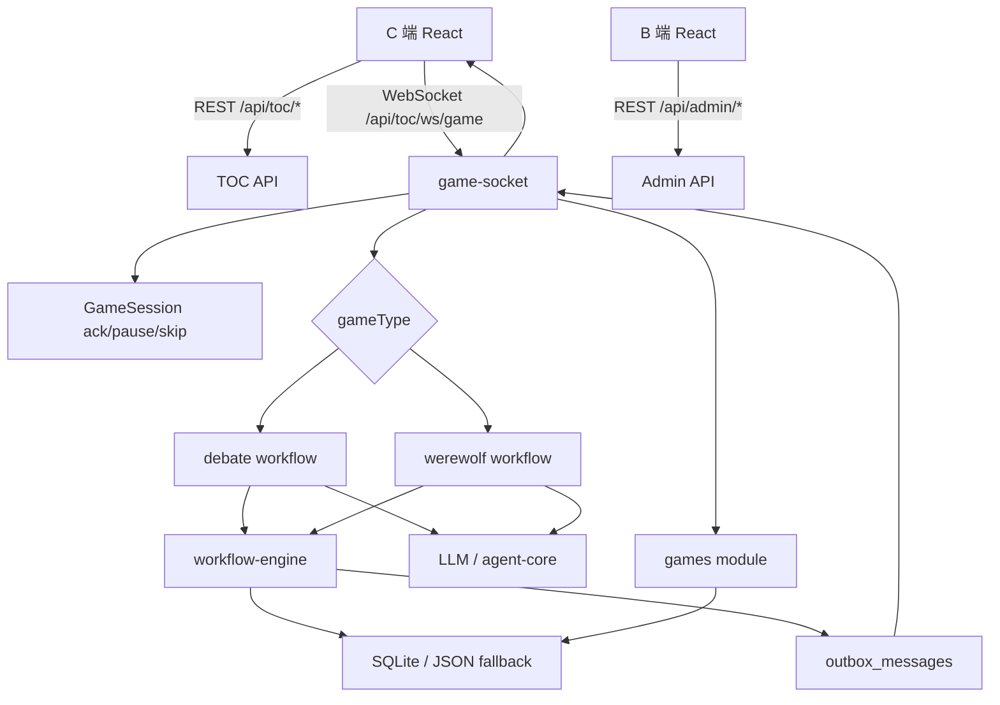

# 项目流程总览

## 项目定位

本项目是一个 AI 桌游/互动游戏原型，采用 pnpm workspace 管理多个包：

- `packages/client`：C 端游戏前台，负责选人、开局、实时播放、回放和游戏结果展示。
- `packages/admin`：B 端管理后台，负责玩家、模型、音色、狼人杀角色/模式、历史对局、AI 观测和工作流调试。
- `packages/server`：Express API、WebSocket、数据库、AI 调度、游戏工作流和对局落库。
- `packages/shared`：前后端共享的类型、schema、常量。
- `tests/workflow`：工作流、狼人杀 reducer/effects/action window 等测试。

## 运行入口

根目录脚本位于 `package.json`：

- `pnpm run dev`：并行启动 workspace 内的开发服务。
- `pnpm run dev:client`：启动 C 端前台。
- `pnpm run dev:admin`：启动 B 端后台。
- `pnpm run dev:server`：启动服务端。
- `pnpm run build`：依次构建 shared、client、admin、server。
- `pnpm run test:workflow`：运行工作流相关测试。

服务端入口：

- `packages/server/index.ts` 创建 HTTP server。
- `packages/server/app.ts` 创建 Express app、挂载 API 路由、注册辩论工作流、初始化种子数据、配置静态资源和 SPA fallback。
- `packages/server/modules/game-socket/service.ts` 将 WebSocket 挂载到 `/api/toc/ws/game`。

## 用户主流程

1. 用户进入 C 端页面。
2. `packages/client/src/App.tsx` 根据当前路由展示首页、游戏选择页或具体游戏页。
3. 游戏选择页选择游戏类型和玩家：
   - `debate`：AI 辩论赛。
   - `werewolf`：AI 狼人杀。
4. 前端通过 `packages/client/src/services/gameService.ts` 请求配置、历史对局、狼人杀模式等数据。
5. 用户开始游戏时，前端打开 WebSocket：`/api/toc/ws/game`。
6. WebSocket 首包发送 `type: "start"`，包含 `gameType`、`playerIds`、主持人、辩题、队伍、狼人杀模式或回放对局 ID。
7. 服务端 `runSession` 校验模式、筛选玩家、解析主持人、检查模型供应商 key。
8. 服务端按 `gameType` 分发核心流程：
   - `debate` -> `runAiDebate` -> `runDebateWorkflow`
   - `werewolf` -> `runWerewolfWorkflow`
9. 游戏流程产生事件，写入工作流 outbox，经 `createPreparedSender` 推送给前端。
10. 前端收到事件后更新界面，并根据事件 `ackId` 控制语音播放/字幕播放/自动推进。
11. 前端播放完毕后发送 `ack`，服务端继续推进下一个事件。
12. 游戏结束后，服务端保存完整对局到 `games` 等表，并发送 `workflow-completed` 事件。

## 后台管理流程

1. 管理后台入口是 `packages/admin/src/main.tsx`。
2. `AdminPage` 使用 `HashRouter` 管理后台路由。
3. 后台页面通过 `packages/admin/src/services/adminApi.ts` 调用 `/api/admin/*`。
4. 管理后台覆盖：
   - 仪表盘。
   - 对局历史。
   - 玩家管理。
   - 模型供应商和模型管理。
   - 音色管理。
   - 狼人杀角色和模式管理。
   - 皮肤管理。
   - AI 观测和 trace 详情。
   - 工作流调试控制台。

## 核心数据流

## 关键设计点

- 前端不直接决定游戏结果，只展示服务端推送的状态和事件。
- 服务端通过工作流引擎管理 match、step、AI task、pending action、event、outbox。
- WebSocket 使用 `ackId` 实现“前端播放完成后服务端再推进”的节奏控制。
- 对局完成后保存完整快照，支持历史详情和回放。
- 管理后台与 C 端分离，后台负责配置和观测，C 端负责游戏体验。

