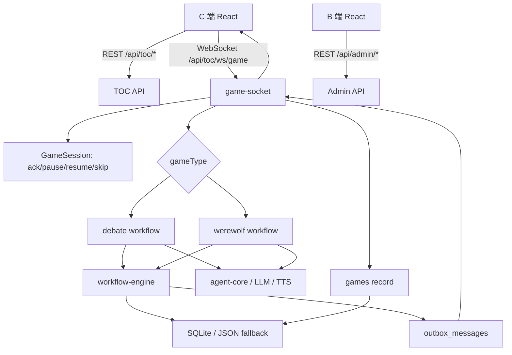

# 项目总体架构

## 项目概述

本项目是一个 AI 桌游/互动游戏原型，提供 C 端游戏前台、B 端管理后台、Express API、WebSocket 实时推进、AI 玩家调度、工作流持久化、历史回放和观测调试能力。

主要功能：

- C 端选择游戏、选择玩家、开始 AI 辩论赛或 AI 狼人杀、实时播放游戏事件、查看历史回放。
- B 端管理玩家、模型供应商、模型、音色、狼人杀角色/模式、皮肤、历史对局、AI trace 和工作流调试。
- 服务端负责游戏规则、AI 调度、工作流推进、事件投影、对局落库、静态资源和统一 API。

## 技术栈

- 语言：TypeScript、少量 CommonJS 运行脚本。
- 包管理：pnpm workspace。
- 前端：React 18、React Router、Vite。
- 服务端：Express、ws、better-sqlite3、zod。
- AI 与语音：OpenAI-compatible 模型配置、Azure Speech、Mimo TTS。
- 观测与测试：OpenTelemetry、Node 测试脚本。

具体依赖和包内命令见对应分文档。

## 目录结构

以下目录树排除 `dist/`、`node_modules/`、`.git/`、`.pnpm-store/`、`.npm-cache/` 等构建产物、依赖和缓存目录。

```txt
.
├── AGENTS.md                  # Codex/AI 协作规范
├── CLAUDE.md                  # Claude/AI 协作规范
├── README.md                  # 项目基础说明
├── .env.example               # 环境变量示例
├── package.json               # 根脚本和 workspace 聚合命令
├── pnpm-workspace.yaml        # pnpm workspace 包声明
├── pnpm-lock.yaml             # 依赖锁定
├── run-web.cmd                # Windows 启动辅助脚本
├── data/
│   ├── consensus-mist.sqlite      # SQLite 数据库
│   ├── consensus-mist.sqlite-shm
│   └── consensus-mist.sqlite-wal
├── docs/
│   ├── README.md
│   ├── project-summary.md
│   ├── project-server.md
│   ├── project-workflow.md
│   ├── project-client.md
│   ├── project-admin.md
│   ├── project-shared.md
│   └── project-prompts.md
├── packages/
│   ├── client/                 # C 端游戏前台
│   ├── admin/                  # B 端管理后台
│   ├── server/                 # Express API、WebSocket、游戏工作流
│   ├── shared/                 # 前后端共享类型、schema、常量
│   └── data/
└── tests/
    ├── migration/
    ├── unit/
    └── workflow/
```

## 架构设计

项目按 monorepo 拆成四个核心包：

- `packages/client`：C 端前台，负责页面渲染、玩家选择、游戏播放、字幕/语音、WebSocket ack、历史回放展示。
- `packages/admin`：B 端后台，负责配置、历史、观测、工作流调试等运营管理能力。
- `packages/server`：服务端，负责 REST API、WebSocket、工作流推进、AI 调度、数据库、静态资源和统一错误处理。
- `packages/shared`：共享类型、schema、常量和工具，降低前后端协议漂移。

核心数据流：



关键原则：

- 前端只负责展示和交互，不决定核心游戏结果。
- 服务端通过 workflow-engine 管理 match、step、AI task、pending action、event、outbox。
- WebSocket 使用 `ackId` 等待前端播放完成后继续推进。
- 游戏完成后保存完整对局快照，支持历史详情和回放。
- 新狼人杀对局同时保存实际展示事件序列；实时和回放共用播放管线，旧对局继续从快照重建。
- 管理后台与 C 端隔离，后台负责配置、观测和调试。

## 文档路由

本节只用于选择应阅读的契约文档，不维护源码入口清单。具体函数、类型、调用链和影响面使用 CodeGraph 查询。

| 任务类型 | 先读文档 | CodeGraph 继续追问 |
| --- | --- | --- |
| 后端 API、数据库、配置、错误处理 | `docs/project-server.md` | 相关 controller/service/repository、迁移、配置读取和调用方 |
| 游戏不推进、ack 卡住、回放异常 | `docs/project-workflow.md` | WebSocket session、workflow tick、outbox、回放投影的调用链 |
| 辩论赛或狼人杀流程异常 | `docs/project-workflow.md` | 对应游戏 workflow、step handler、reducer、presentation、runner 的影响面 |
| 狼人杀 AI prompt、行动理由、LLM trace | `docs/project-prompts.md` | prompt builder、PromptContext、agent-core、LLM record 的调用路径 |
| C 端页面、播放、字幕、选人问题 | `docs/project-client.md` | 路由、feature 容器、socket hook、播放队列、service 调用方 |
| B 端配置、历史、观测、调试页面 | `docs/project-admin.md` | 管理页面、admin API service、表单状态和后端资源模块 |
| shared 类型、schema、常量、测试失败 | `docs/project-shared.md` | 类型定义、schema 消费方、测试入口和跨包引用 |

## 配置与部署

根目录脚本：

- `pnpm run dev`：并行启动 workspace 开发服务。
- `pnpm run dev:server`：启动服务端。
- `pnpm run dev:client`：启动 C 端前台。
- `pnpm run dev:admin`：启动 B 端后台。
- `pnpm run build`：依次构建 shared、client、admin、server。
- `pnpm run start`：启动服务端。
- `pnpm run check`：运行各包 TypeScript 检查。
- `pnpm run test:unit`：运行单元测试。
- `pnpm run test:workflow`：运行工作流测试。
- `pnpm run test:migration`：运行迁移测试。
- `pnpm run test:concurrency`：对已启动的本地服务发起 5 局并发调试对局并输出结构化结果。

服务端端口：

- 开发默认 `3001`。
- 可通过 `API_PORT` 指定。
- 生产环境优先读取 `PORT`。

环境变量示例见 `.env.example`：

- Azure Speech：`AZURE_SPEECH_KEY`、`AZURE_SPEECH_REGION`、`AZURE_SPEECH_ENDPOINT`
- Mimo TTS：`MIMO_API_KEY`、`MIMO_BASE_URL`、`MIMO_TTS_MODEL`、`MIMO_TTS_FORMAT`、`MIMO_TTS_VOICE`
- Cloudflare：`CLOUDFLARE_ACCOUNT_ID`
- 数据库模型密钥：`DATABASE_MODEL_API_KEY`
- 生产认证：`JWT_SECRET`（至少 32 字符）、`ADMIN_USERNAME`、`ADMIN_PASSWORD`（至少 12 字符）。生产环境缺失或强度不足时服务拒绝启动。账号仅在管理员表为空时创建一次，首次登录必须改密；已有账号不会被环境变量覆盖。
- Docker Compose：生产 `.env` 固定 `COMPOSE_PROJECT_NAME=consensus`，便于稳定识别数据库和资源 volume。

构建产物：

- C 端构建到 `dist/client`。
- B 端构建到 `dist/admin`。
- 服务端通过 Express 静态托管这些产物。
- `dist/` 是构建产物目录，不纳入源码目录树。

### GitHub Actions 自动部署到腾讯云

`.github/workflows/deploy-master.yml` 监听 `master` 分支 push，也支持手动触发。流程先在 GitHub runner 中使用 Node.js 20 与 pnpm 9.15.4 安装锁定依赖，依次执行类型检查、完整构建、单元测试、工作流测试、迁移测试和最终 runtime 镜像构建；全部通过后才通过 SSH 登录腾讯云 CVM，在服务器项目目录执行：

```bash
git fetch origin master
git reset --hard origin/master
docker compose up -d --build
docker compose ps
```

腾讯云 CVM 需要提前安装 Docker，并安装 `docker compose` 插件或旧版 `docker-compose` 命令；需要提前 clone 本仓库，并在项目目录放置生产 `.env`。`consensus-data` 保存 SQLite，`consensus-resources` 保存上传图片和生成语音，头像继续使用 `./avatars` bind mount。部署脚本不会把 GitHub Secrets 写入仓库。

公网 HTTPS 由腾讯云负载均衡终止，负载均衡通过 HTTP/WebSocket 回源 CVM 的 Nginx 80 端口。CVM 安全组必须只允许负载均衡访问 80 端口；应用和 Nginx 不直接暴露公网 TLS。部署完成后先确认 `docker compose ps` 中 `app` 为 healthy，再通过生产域名请求 `/api/toc/health`。

GitHub 仓库需要配置以下 Secrets：

- `TENCENT_CLOUD_HOST`：腾讯云 CVM 公网 IP 或域名。
- `TENCENT_CLOUD_USER`：SSH 登录用户。
- `TENCENT_CLOUD_SSH_KEY`：可登录服务器的私钥内容。
- `TENCENT_CLOUD_SSH_PORT`：SSH 端口，可不填，默认 `22`。
- `TENCENT_CLOUD_PROJECT_PATH`：服务器上的项目目录，例如 `/opt/consensus`。

## 扩展点与注意事项

- 新增 C 端业务能力优先放入 `packages/client/src/features/<featureName>`。
- 新增后台页面优先放入 `packages/admin/src/pages`，API 调用集中在 `services/adminApi.ts`。
- 新增后端资源模块优先遵循 `controller/service/repository/routes/validator` 分层。
- 新增游戏或复杂流程时，需要同步考虑 workflow、WebSocket 事件、前端投影、对局保存、测试和文档。
- 修改共享协议时，优先更新 `packages/shared`，再同步前后端消费方。
## Werewolf mode coverage

- Default werewolf mode coverage now includes boards 1-19 from the local rule list, including `wild-child-12`, `bombman-12` and `nine-tailed-fox-12`.
- The expansion uses existing workflow, event, snapshot and seed mechanisms; no new top-level package, database table or deployment command was added.
- Latest local werewolf expansion includes mode 27 `ghost-bride-thief-12`, implemented with existing workflow/event/snapshot mechanisms and no database schema change.
- Latest local werewolf expansion includes mode 28 `firepower-12`. Mode 29 is skipped because the local rule list only says `略` and does not provide executable rules.

## Werewolf mode coverage update

- Default werewolf mode coverage now includes mode 30 `magic-wolf-demon-hunter-12`.
- Mode 29 remains skipped because the local rule list is insufficient for executable workflow rules.
- Mode 30 reuses the existing werewolf workflow, event, snapshot, debug and seed mechanisms; no new package, database table or deployment command was added.
