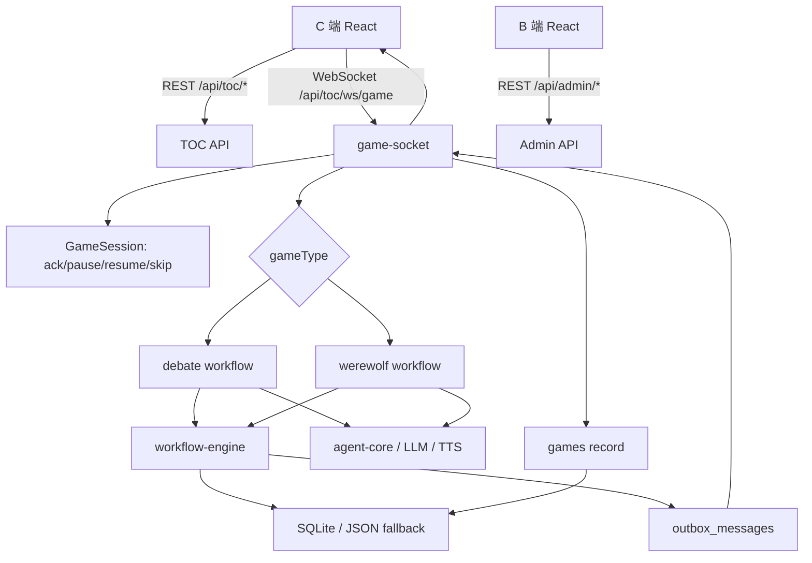

# 项目总体架构

## 项目概述

本项目是一个 AI 桌游/互动游戏原型，提供 C 端游戏前台、B 端管理后台、Express API、WebSocket 实时推进、AI 玩家调度、工作流持久化、历史回放和观测调试能力。

主要功能：

- C 端选择游戏、选择玩家、开始 AI 辩论赛或 AI 狼人杀、实时播放游戏事件、查看历史回放。
- B 端管理玩家、模型供应商、模型、音色、狼人杀角色/模式、皮肤、历史对局、AI trace 和工作流调试。
- 服务端负责游戏规则、AI 调度、工作流推进、事件投影、对局落库、静态资源和统一 API。

## 技术栈

- 语言：TypeScript、少量 CommonJS 运行脚本。
- 包管理：pnpm workspace。
- 前端：React 18、React Router、Vite。
- 服务端：Express、ws、better-sqlite3、zod。
- AI 与语音：OpenAI-compatible 模型配置、Azure Speech、Mimo TTS。
- 观测与测试：OpenTelemetry、Node 测试脚本。

具体依赖和包内命令见对应分文档。

## 目录结构

以下目录树排除 `dist/`、`node_modules/`、`.git/`、`.pnpm-store/`、`.npm-cache/` 等构建产物、依赖和缓存目录。

```txt
.
├── AGENTS.md                  # Codex/AI 协作规范
├── CLAUDE.md                  # Claude/AI 协作规范
├── README.md                  # 项目基础说明
├── .env.example               # 环境变量示例
├── package.json               # 根脚本和 workspace 聚合命令
├── pnpm-workspace.yaml        # pnpm workspace 包声明
├── pnpm-lock.yaml             # 依赖锁定
├── run-web.cmd                # Windows 启动辅助脚本
├── data/
│   ├── consensus-mist.sqlite      # SQLite 数据库
│   ├── consensus-mist.sqlite-shm
│   └── consensus-mist.sqlite-wal
├── docs/
│   ├── README.md
│   ├── project-summary.md
│   ├── project-server.md
│   ├── project-workflow.md
│   ├── project-client.md
│   ├── project-admin.md
│   ├── project-shared.md
│   └── project-prompts.md
├── packages/
│   ├── client/                 # C 端游戏前台
│   ├── admin/                  # B 端管理后台
│   ├── server/                 # Express API、WebSocket、游戏工作流
│   ├── shared/                 # 前后端共享类型、schema、常量
│   └── data/
└── tests/
    ├── migration/
    ├── unit/
    └── workflow/
```

## 架构设计

项目按 monorepo 拆成四个核心包：

- `packages/client`：C 端前台，负责页面渲染、玩家选择、游戏播放、字幕/语音、WebSocket ack、历史回放展示。
- `packages/admin`：B 端后台，负责配置、历史、观测、工作流调试等运营管理能力。
- `packages/server`：服务端，负责 REST API、WebSocket、工作流推进、AI 调度、数据库、静态资源和统一错误处理。
- `packages/shared`：共享类型、schema、常量和工具，降低前后端协议漂移。

核心数据流：



关键原则：

- 前端只负责展示和交互，不决定核心游戏结果。
- 服务端通过 workflow-engine 管理 match、step、AI task、pending action、event、outbox。
- WebSocket 使用 `ackId` 等待前端播放完成后继续推进。
- 游戏完成后保存完整对局快照，支持历史详情和回放。
- 管理后台与 C 端隔离，后台负责配置、观测和调试。

## 核心模块索引

- 后端服务架构：见 `docs/project-server.md`。
- 游戏工作流与 AI 调度：见 `docs/project-workflow.md`。
- 狼人杀 AI 玩家提示词与 LLM 调用：见 `docs/project-prompts.md`。
- C 端游戏前台：见 `docs/project-client.md`。
- B 端管理后台：见 `docs/project-admin.md`。
- 共享类型、schema、测试：见 `docs/project-shared.md`。

## AI 快速定位表

| 问题类型 | 先读文档 | 主要源码入口 |
| --- | --- | --- |
| 游戏不推进、ack 卡住、回放异常 | `docs/project-workflow.md` | `packages/server/modules/game-socket/service.ts`、`packages/server/modules/game-socket/session.ts`、`packages/server/modules/workflow-engine/tick.ts` |
| 辩论赛流程或 AI 发言异常 | `docs/project-workflow.md` | `packages/server/aiDebateRunner.ts`、`packages/server/modules/debate/workflow.ts`、`packages/client/src/features/debate/DebateGame` |
| 狼人杀阶段、角色、胜负判断异常 | `docs/project-workflow.md` | `packages/server/modules/werewolf/workflow.ts`、`packages/server/modules/werewolf/steps.ts`、`packages/server/modules/werewolf/reducers.ts` |
| C 端页面、播放、字幕、选人问题 | `docs/project-client.md` | `packages/client/src/App.tsx`、`packages/client/src/services/gameService.ts`、`packages/client/src/hooks/useGameSocketSession.ts` |
| 后台配置、历史、观测、调试问题 | `docs/project-admin.md` | `packages/admin/src/components/AdminPage/index.tsx`、`packages/admin/src/services/adminApi.ts` |
| 后端 API、数据库、配置问题 | `docs/project-server.md` | `packages/server/app.ts`、`packages/server/db/migrations.ts`、`packages/server/modules/*` |
| 类型、schema、测试失败 | `docs/project-shared.md` | `packages/shared/types`、`packages/shared/schemas`、`tests` |

## 配置与部署

根目录脚本：

- `pnpm run dev`：并行启动 workspace 开发服务。
- `pnpm run dev:server`：启动服务端。
- `pnpm run dev:client`：启动 C 端前台。
- `pnpm run dev:admin`：启动 B 端后台。
- `pnpm run build`：依次构建 shared、client、admin、server。
- `pnpm run start`：启动服务端。
- `pnpm run check`：运行各包 TypeScript 检查。
- `pnpm run test:unit`：运行单元测试。
- `pnpm run test:workflow`：运行工作流测试。
- `pnpm run test:migration`：运行迁移测试。

服务端端口：

- 开发默认 `3001`。
- 可通过 `API_PORT` 指定。
- 生产环境优先读取 `PORT`。

环境变量示例见 `.env.example`：

- Azure Speech：`AZURE_SPEECH_KEY`、`AZURE_SPEECH_REGION`、`AZURE_SPEECH_ENDPOINT`
- Mimo TTS：`MIMO_API_KEY`、`MIMO_BASE_URL`、`MIMO_TTS_MODEL`、`MIMO_TTS_FORMAT`、`MIMO_TTS_VOICE`
- Cloudflare：`CLOUDFLARE_ACCOUNT_ID`
- 数据库模型密钥：`DATABASE_MODEL_API_KEY`

构建产物：

- C 端构建到 `dist/client`。
- B 端构建到 `dist/admin`。
- 服务端通过 Express 静态托管这些产物。
- `dist/` 是构建产物目录，不纳入源码目录树。

## 扩展点与注意事项

- 新增 C 端业务能力优先放入 `packages/client/src/features/<featureName>`。
- 新增后台页面优先放入 `packages/admin/src/pages`，API 调用集中在 `services/adminApi.ts`。
- 新增后端资源模块优先遵循 `controller/service/repository/routes/validator` 分层。
- 新增游戏或复杂流程时，需要同步考虑 workflow、WebSocket 事件、前端投影、对局保存、测试和文档。
- 修改共享协议时，优先更新 `packages/shared`，再同步前后端消费方。
