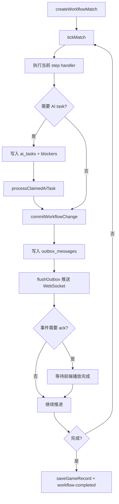

# 游戏工作流与 AI 调度

## 项目概述

游戏工作流是服务端最复杂的部分，负责把辩论赛、狼人杀、谁是卧底等游戏拆成可持久化、可调试、可重放的步骤，并通过 WebSocket 按播放节奏推送给 C 端。

## 技术栈

- TypeScript
- ws WebSocket
- better-sqlite3 持久化
- zod schema
- OpenAI-compatible LLM 调用
- TTS 语音资源生成

## 稳定目录边界

本节只记录工作流相关模块的长期职责边界，帮助判断改动是否影响 WebSocket、workflow-engine、game-engine、AI task 或游戏规则契约；具体文件位置、符号定义、调用方和影响面使用 CodeGraph 查询。

```txt
packages/server/modules/
├── game-socket/
│   ├── service.ts       # attachGameSocket、runSession、definition runner 调用
│   ├── session.ts       # send/sendAndWait/ack/pause/resume/skip
│   ├── sender.ts        # 事件准备、推送、音频资源维护
│   ├── replay.ts        # 历史对局回放
│   ├── narration.ts     # 事件旁白
│   ├── media.ts         # 媒体资源处理
│   ├── displayQueue.ts
│   ├── gameRunner.ts    # definition 驱动的 runner 解析；只保留两个旧游戏兼容入口
│   └── constants.ts
├── workflow-engine/
│   ├── workflowRegistry.ts # workflow 和 step handler 注册
│   ├── service.ts          # match、tick、AI task、pending action、interrupt
│   ├── tick.ts             # 推进当前 match step
│   ├── repository.ts       # workflow 数据读写
│   ├── aiTaskWorker.ts     # AI task 执行
│   ├── effects.ts          # effect 与 interrupt
│   ├── projection.ts       # 状态投影
│   ├── routes.ts
│   └── controller.ts
├── game-engine/
│   ├── engine/             # GameEngine、definition registry、invariant checker
│   ├── workflow/           # WorkflowRuntime（workflow-engine 包装）
│   ├── action-window/      # ActionWindow 生命周期和提交校验
│   ├── agent/              # AgentRuntime contract
│   ├── skill/              # SkillRegistry contract
│   ├── effect/             # EffectQueue、EffectResolver
│   ├── event/              # DomainEvent EventBus
│   ├── channel/            # ChannelSystem 可见性校验
│   └── state/              # MatchStateStore 与 SQLite adapter
├── engine-registry.ts      # GameEngine 单例 + 游戏注册
├── debate-runner.ts        # 辩论赛 GameEngine runner
├── werewolf-runner.ts      # 狼人杀 GameEngine runner
├── debate/
│   ├── workflow.ts
│   ├── service.ts
│   ├── definition.ts       # DebateGameDefinition
│   ├── helpers.ts          # 共享函数（agent 创建、序列化、投票等）
│   ├── phases.ts
│   ├── skillRegistry.ts
│   ├── roleSkills.ts
│   ├── playerAgent.ts
│   ├── prompts.ts
│   ├── report.ts
│   └── speech.ts
├── werewolf/
│   ├── workflow.ts
│   ├── runtime.ts
│   ├── steps.ts
│   ├── actionWindows.ts
│   ├── actionPhases.ts
│   ├── aiActions.ts
│   ├── reducers.ts
│   ├── effects.ts
│   ├── presentation.ts
│   ├── channelRouter.ts
│   ├── views/
│   ├── handlers/
│   ├── prompts/
│   ├── roles.ts
│   ├── roleSkills.ts
│   ├── sheriffWorkflow.ts
│   ├── winCheck.ts
│   └── wolfTeam.ts
├── undercover/              # 固定六人的规则、prompt、公开投影、workflow 与 definition runtime
├── agent-core/
│   ├── playerAgent.ts
│   ├── gameAgent.ts
│   ├── skillRegistry.ts
│   ├── skillExecutor.ts
│   ├── roleSkillRegistry.ts
│   ├── skillEventEmitter.ts
│   └── fallbackAudit.ts
├── llm/
├── tts/
├── game-memory/
└── games/
```

## 架构设计

工作流核心对象是一局 `match`：

- `matches` 保存当前状态、step、版本、blockers、错误。
- `workflow_events` 保存事件流。
- `ai_tasks` 保存待执行 AI 任务。
- `pending_actions` 保存等待提交的行动。
- `outbox_messages` 保存待推送给前端的消息。
- `match_snapshots` 保存状态快照。

### 统一持续驱动入口

- `WorkflowRuntime.runUntilBlocked()` 是离线 runner 持续推进 match 的统一入口，内部复用 `drainAiTasks()`，跨 tick 预算分批运行，直到没有可处理工作或进入 `completed/failed/paused_debug`。
- `GameEngine.runUntilBlocked()` 只做该 runtime 能力的公开委托；狼人杀 runner 不再自行复制 `while + drainAiTasks` 循环。
- WebSocket ACK 驱动仍可按单事件调用底层 service，不改变播放节奏、暂停、跳过或连接协议。
- 赛后 `mvp_vote/postgame_speech` 是 match 级动作，不得创建或修改无日期 round；所有 round-bound reducer 在创建 round 前必须具有正整数 `day`。

### Workflow 持久化性能与恢复

- 调试 match 的 `tickMatch` 与 `commitWorkflowChange` 会输出结构化
  `workflow-persistence-timing` 日志，使用同一 `correlationId` 关联一次推进。
- 日志拆分状态恢复、handler、JSON 序列化、event/outbox/match/snapshot 写入、
  事务总耗时及 `transactionCommitMs`，并记录数据库/WAL 文件大小变化。
  `transactionCommitMs` 表示同步事务回调结束到事务返回的综合 COMMIT/WAL/fsync
  时间，不是操作系统级单独 fsync 指标。
- `workflow_events` 不再为每个事件保存完整 `projectedState`。状态变化使用内部
  `statePatch`，由 `set` 和 `remove` 路径操作组成；数组整体替换。
- `match_snapshots.last_event_seq` 是恢复水位。新快照只重放
  `seq > last_event_seq` 的事件；旧快照没有水位时继续按时间戳兼容恢复。
- 恢复结果会与 `matches.state_json` 对比。不一致时输出
  `workflow-projection-mismatch` 审计日志并采用最新 match 状态。
- 等待点、终态或距上次快照累计 10 个事件时创建快照；每个 match 仅保留最近
  3 个快照。
- `debugMode` 终态 match 仅保留最近 20 局。服务启动和调试对局进入终态时清理。
- `running` / `waiting` match 若 `updated_at` 超过 7 天未变化，服务启动时立即清理，
  并在持续运行期间每 24 小时再次清理；刚好 7 天的 match 保留。
- 两类清理都硬删除 `matches` 并依赖外键级联，不会在在线服务中自动执行阻塞式
  `VACUUM`。
- 狼人杀调试模式只跳过真实模型与语音依赖，不跳过玩法分支。禁言长老、骑士、
  花蝴蝶、潜行者、狼美人、噩梦之影、摄梦人、魔术师等特殊技能，以及白狼王自爆，会按调试
  随机概率决定是否发动，结果继续进入原有 reducer、死亡链和播放管线。

推进模型：



## 核心模块

### game-socket

- `attachGameSocket(server)`：把 WebSocketServer 挂到 HTTP server。
- `runSession`：根据首包启动真实游戏或回放。
- `getRequestConfig`：解析玩家、主持人、模式和模型 key 状态。
- `resolveGameRunner()`：从已注册 `GameDefinition` 解析 session/runtime；只有辩论赛和狼人杀走兼容 runner，其他已注册游戏走通用 definition runtime。
- `GameSession`：封装 `send`、`sendAndWait`、`resolveAck`、`pause`、`resume`、`skipCurrentPhase`。
- `sender`：准备事件、维护音频资源并推送给前端。
- `replay`：读取历史对局并按事件节奏回放。

### workflow-engine

- `workflowRegistry`：注册 workflow 和 step handler。
- `service`：创建 match、推进 tick、领取/完成 AI task、提交 pending action、创建/解决 interrupt、查询 debug state 和 outbox。
- `tick`：执行当前 step handler 并移动 workflow 状态。
- `repository`：读写 match、event、task、pending action、outbox 等。
- `aiTaskWorker`：执行已领取 AI task。
- `effects`：管理工作流效果和 interrupt。
- `projection`：生成前端或调试所需状态投影。

### game-engine

`game-engine` 是所有游戏的统一注册入口。辩论赛和狼人杀通过兼容 runner 委托 `GameEngine` 创建对局；谁是卧底及后续定义型游戏直接运行 `GameDefinition.runtime`。

- `GameEngine`：注册 `GameDefinition`、创建 match、tick、提交 action、解析 pending effect、运行自定义 runtime，并提供 `getDebugState(matchId)`。
- `GameDefinitionRegistry`：按 `gameType@version` 注册和查询游戏定义。
- `WorkflowRuntime`：包装现有 `workflow-engine` 创建和推进能力。
- `ActionWindowManager`：校验 ActionWindow 是否存在、是否打开、actor/actionType 是否合法。
- `EffectQueue`：把合法 `DomainAction` 转为 `WorkflowEffect` 并写入队列。
- `EffectResolutionService`：通过 resolver 把 effect 结算为 `DomainEvent`，再按游戏定义的 `projectState` 投影回 match state。
- `ChannelSystem`：校验所有 `DomainEvent` 必须声明 channel，`scope` event 必须声明 `scopeKey`。
- `InvariantChecker`：聚合 debug state 中的 channel、effect lifecycle、重复 idempotencyKey 等不变量问题。
- `MatchStateStore`：隔离 core 与 SQLite 细节，SQLite adapter 复用现有 `matches`、`pending_actions`、`workflow_effects`、`workflow_events`。

#### 游戏注册与运行入口

`engine-registry.ts` 提供 `getGameEngine()` 单例，首次调用时自动注册所有已实现的 `GameDefinition`：

- 辩论赛：`createDebateGameDefinition()`（`debate/definition.ts`）
- 狼人杀：`createWerewolfGameDefinition()`（`werewolf/definition.ts`）
- 谁是卧底：`createUndercoverGameDefinition()`，注册 `undercover.workflow.standard.v1` 与 definition runtime

游戏运行入口：

- `debate-runner.ts`：`runDebateViaEngine()` — 通过 `engine.createMatch()` 创建对局，`drainAiTasks()` 循环推进。
- `werewolf-runner.ts`：`runWerewolfViaEngine()` — 通过 `engine.createMatch()` 创建对局，设置 EventBus 基础设施，`drainAiTasks()` 循环推进。
- 其他已注册游戏：runner resolver 读取 definition 的 runtime、开场/结束文案、玩家数量与播放参数，再调用通用 `engine.runGame()`；未注册游戏或缺少 runtime 的游戏会显式失败，不回退到狼人杀。
- `drainAiTasks()` 遇到 `running`、无 blocker 且暂无 AI task 的 match 时会继续 tick；这用于跨过单次 tick 预算耗尽或连续确定性/跳过步骤，不能把“当前无 task”当作流程结束。

`debate`、`werewolf` 是仅有的两个 legacy compatibility runner。`game-socket` 不得为 `undercover` 或后续 definition-runtime 游戏增加按游戏类型分支。

`game-socket` 的通用 runner resolver 只对这两个旧游戏选择兼容 runner，其余游戏走 definition runtime。

当前狼人杀 adapter 只迁移低风险动作：

- `wolf_vote` / `wolf_kill` -> `kill` effect -> `wolf_target_selected` wolves scope event -> 更新 `round.night.wolfChoices / wolfVoteTally / wolfTarget / wolfStrategy`。
- `seer_check` -> `inspect` effect -> `seer_checked` scope event -> 更新 `round.night.seerCheck` 和预言家玩家记录。
- `guard_protect` -> `protect` effect -> `guard_protected` scope event -> 更新 `round.night.guardTarget` 和守卫玩家记录。
- `witch_save` -> `save` effect -> `witch_saved` scope event -> 更新 `round.night.witchSave / witchSaveTarget` 和女巫解药使用状态。
- `witch_poison` -> `poison` effect -> `witch_poisoned` scope event -> 更新 `round.night.witchPoisonTarget` 和女巫毒药使用状态。

狼队刀口 event 是 `scope: wolves`，只表达狼队内部目标选择，不公开给普通观众，也不直接造成死亡。
女巫相关 event 仍是 `scope: witch`，不会公开给普通观众；公开死亡结算仍由现有夜间结算流程处理。

女巫夜间行动资格按药瓶独立计算：

- `witch_save` 仅在女巫存活、解药未使用且当晚存在狼刀目标时打开；只有此时女巫 prompt 和私密展示事件才能携带刀口。
- 解药已使用或平安夜时，解药 step 直接完成，不创建 action window，也不产生 C 端唤醒、结果或跳过展示。
- `witch_poison` 只依赖女巫存活、毒药未使用及 `onePotionPerNight` 限制，不因解药耗尽而失效，且其提示不得携带 `wolfTarget`。
- 两瓶药均耗尽或女巫已出局时，两个固定 workflow step 都静默跳过；跳过原因只写入 `channel: system` 的审计事件。
- 当前板子没有对应行动角色时，固定 workflow step 同样只生成 `channel: system` 的跳过审计事件，不进入实时播放或历史回放。
- `EventDeliverySubscriber` 不向实时播放回调交付 system channel，确保内部跳过和审计不会进入精确回放事件。

夜间死亡结算已新增旁路 resolver：

- `night_resolution` effect -> `night_resolved` public event，只公开 `day/deaths/message`。
- 同一 resolver 额外产出 `night_resolution_audited` system event，记录内部输入、effects 和死亡明细，供 debug 使用。
- `night_resolved` 可投影 `round.night.deaths`、`nightRevealed`、`publicSummary` 和死亡玩家状态。

Shadow audit 接入方式：

- `werewolf.night_resolve` 仍以 legacy `resolveNightEffects` 作为真实结算主路径。
- handler 在 legacy 结算前克隆输入 state，结算后调用 Engine Core `resolveEngineNightResolution` 做旁路对比。
- 对比结果写入 `werewolf_night_resolution_shadow_audited` system event，包含 `matched / mismatched / audit_failed` 状态。
- shadow audit event 必须使用 `visibility: system`，只供 debug/invariant 使用，不进入 C 端 outbox。
- B 端 `WorkflowDebugConsole` 会从 debug API 的 `events` 中汇总展示 shadow audit 结果，便于确认真实对局是否长期 matched。

旁路 resolver 暂不接管真实 `werewolf.night_resolve` handler，避免同时改动猎人开枪窗口、胜负检查、trace 快照和 C 端播放链路。

### 辩论赛流程

入口：

- `packages/server/aiDebateRunner.ts`
- `packages/server/modules/debate/workflow.ts`

工作流 ID：

- `debate.workflow.v1`

主流程：公布辩题 -> 正反方立论 -> 多轮攻辩 -> 双方总结 -> 评委点评和投票 -> MVP 投票 -> 公布结果。

关键机制：

- `createDebateWorkflowMatch` 创建 match 和初始辩论状态。
- 每个 AI turn 生成 `ai_tasks`。
- `executeSkillWithTrace` 调用辩论技能。
- `validateAiResult` 校验 AI 输出。
- `applyAiTurnResult` 把 AI 输出写入 phase、speech、winner、mvp。
- `serializeDebateState` 输出前端可展示状态。

### 辩论赛调试模式

- `debugMode` 会在 GameEngine 和直接 workflow 两条创建路径中保留。
- 辩论技能层在调用模型前返回固定发言、合法裁判结果和合法 MVP 目标，
  但仍执行正式阶段、事件、校验和结束流程。
- 序列化快照包含 `debugMode: true`，因此通用媒体层不生成服务端 TTS；
  客户端继续使用浏览器语音和字幕。
- 通用 game-socket 保存逻辑已对调试对局跳过正式历史写入。

### 狼人杀流程

入口：

- `packages/server/modules/werewolf/workflow.ts`
- `packages/server/modules/werewolf/runtime.ts`

工作流 ID：

- `werewolf.workflow.basic.v1`

主流程：分配身份 -> 按天循环夜晚行动和白天发言投票 -> 首日可进入警长竞选 -> 夜间结算、放逐结算和胜负检查 -> 结束归档。

关键机制：

- `createWerewolfSteps()` 根据最大天数生成流程。
- `createInitialWerewolfState` 根据模式展开角色槽、随机分配身份、创建 agent。
- `createRuntime` 从 match/state 恢复 agent、技能注册和上下文。
- action window step 创建 AI 行动窗口或 pending action。
- 夜间结算、放逐结算、胜负检查由服务端规则处理。
- `serializeWerewolfState` 输出前端可展示状态。
- 视角投影避免普通视角看到隐藏身份和私密信息。

### 谁是卧底流程

游戏类型为 `undercover`，工作流 ID 为 `undercover.workflow.standard.v1`。首版边界固定为 6 名 AI 玩家、1 名卧底和最多 3 轮：每轮存活玩家依序描述，随后全员投票；首次平票进入一次复投，复投仍平票时按服务端种子稳定淘汰。卧底出局时平民胜，卧底存活到最后 3 人时卧底胜，命中胜负后直接跳到结果 step。

隐私与兜底契约：

- 生产对局由服务端从固定、已审核的内置 `UNDERCOVER_WORD_PAIRS` 词对列表中选择词对，并生成随机种子和卧底座位；只有 `debugMode === true` 的调试 match 可以覆盖这些值，不接受任意生成词对或后台输入。
- 每个 Agent 只收到自己的词、公开发言和本次合法投票目标，并被明确告知不知道自己是否为卧底；不得向其他 Agent 或公开事件暴露另一词语、完整词对或卧底座位。
- 公开投影逐字段构造。终局前不得包含 `wordPair`、`playerWords`、`undercoverPlayerId`、`winner`、`winReason` 或逐人 ballot；投票只公开汇总票数、平票候选、是否复投和淘汰结果。
- 结构化输出先按 schema/contract 校验；失败后只追加一次纠错指令并重试，即最多两次结构化模型输出尝试。两次仍不合规时，描述使用固定中性文本，投票按当前合法目标与服务端种子稳定兜底。该契约重试独立于单次调用内部复用的主模型/备选模型 provider 故障转移，两者不得混为额外规则重试。
- 只有 `undercover-game-result` 的 completed 投影携带 `winner/winReason/reveal`，其中 reveal 含双方词语和卧底座位。保存的精确播放序列同样只允许最终结果事件携带揭示数据。

实时与回放复用现有 PlaybackPipeline、TTS/字幕、ACK、outbox 和对局保存。首版不增加数据库表、REST API、WebSocket start/control/ack 消息，也不提供可配置人数/轮数/卧底数量、自定义词库管理、通用游戏 DSL、真人行动、赛后 MVP 或独立复盘流程；浏览器级实时 WebSocket E2E 作为后续验收工作明确延后。

### agent-core

- `playerAgent`：玩家 agent。
- `gameAgent`：游戏 agent。
- `skillRegistry`：技能注册。
- `skillExecutor`：技能执行。
- `roleSkillRegistry`：按角色应用技能。
- `fallbackAudit`：记录兜底行为。

## WebSocket 协议与数据流

- 客户端入站消息仅接受 `start`、`ack`、`control`、`randomize-teams` 四类结构；未知字段或非法载荷返回 `INVALID_MESSAGE`。
- WebSocket 单条消息限制为 64 KiB。`start` 保留现有客户端兼容字段，不改变公开消息结构。

### 狼人杀统一播放事件管线

狼人杀实时播放和新对局回放共用
`PlaybackEventSource -> PlaybackPipeline -> DisplayQueue -> WebSocket`：

- 实时 EventBus 事件经现有视角投影后进入 `PlaybackPipeline`。
- 展示事件完成旁白和媒体准备后、发送 ACK 前转换为 `PlaybackEvent`。
- 对局完成时，游戏快照与完整播放事件在同一事务中保存。
- 新对局回放按序发送已保存的最终展示载荷，不重新生成文案或音频。
- 每次实时播放或回放仍使用独立 WebSocket 连接和独立 ACK 序列。
- 正式对局以服务端 workflow 返回 `completed` 为保存条件，不等待 C 端看完终局播放或完成 ACK。
- workflow 完成后冻结已准备的实时播放前缀，并离线准备尚未发送的终局事件及
  `workflow-completed` 事件；完整序列与游戏、玩家映射和长期记忆在同一事务提交。
- 数据库提交成功后才允许发送 `workflow-completed`。终局播放期间断线不影响保存；
  保存失败发送错误且不得发送假完成事件。
- `failed`、`paused_debug`、`waiting` 状态不会返回可保存结果；调试模式继续只保留
  观测数据，不写正式游戏记录。
- 播放事件绑定原始 `clientViewMode`，回放不能切换为其他视角。
- 没有播放事件记录的旧对局继续由 `replay.ts` 根据快照重建。

前端首包：

```ts
type GameSocketStartPayload = {
  type: 'start';
  mode: 'real';
  gameType: string;
  playerIds?: number[];
  hostId?: number | string;
  topic?: unknown;
  debateTeams?: unknown;
  werewolfMode?: string;
  clientViewMode?: string;
  replayView?: boolean;
  replayGameId?: string;
};
```

ack 流程：

1. 服务端发送事件。
2. 如果事件需要等待播放，`sendAndWait` 注入 `ackId`。
3. 前端更新界面并播放语音/字幕。
4. 前端发送 `ack`。
5. 服务端继续推进。

控制消息支持：

- `pause`
- `resume`
- `skip-phase`

## 配置与部署

每个 WebSocket session 同时只能运行一局；重复 `start` 返回错误。实时新对局占用进程级游戏 lease，回放不占用；成功、失败、取消和断线都会在 `finally` 中释放。LLM/TTS 外部请求分别经过 FIFO 并发门禁，Trace 使用 `AsyncLocalStorage` 隔离并发对局上下文。

工作流依赖服务端启动：

```bash
pnpm run dev:server
pnpm run test:workflow
```

调试 API 挂载在 `/api/admin` 下：

- `GET /workflow/matches/:matchId/debug`
- `POST /workflow/matches/:matchId/tick`
- `POST /workflow/matches/:matchId/actions/:actionId/submit`
- `POST /workflow/ai-tasks/:taskId/retry`
- `POST /workflow/ai-tasks/:taskId/cancel`
- `POST /workflow/ai-tasks/:taskId/manual-complete`
- `POST /workflow/matches/:matchId/interrupts`
- `POST /workflow/interrupts/:interruptId/resolve`

## 扩展点与注意事项

- 新增游戏优先新增独立 workflow，并通过注册 `GameDefinition.runtime`、session metadata 和玩家选择约束接入通用 runner；不要为每个新游戏增加 `game-socket` 类型分支。
- 所有可持久化流程变化都要考虑 event、snapshot、outbox 和回放兼容性。
- AI 输出必须校验，不允许直接信任模型返回。
- 需要等待前端播放的事件必须使用 ack，避免服务端推进过快。

## Werewolf interaction feedback trace

狼人杀角色交互在行动结果生效后，会记录内部 trace 事件 `werewolf_interaction_feedback`。该事件只用于 B 端观测，不作为 C 端 socket/display 事件。

覆盖行动：

- `seer_check`：`scope: seer`，记录查验目标和阵营结果。
- `guard_protect`：`scope: guard`，记录守护目标。
- `witch_save`：`scope: witch`，仅在解药可用时记录是否使用解药、救人目标和狼刀目标。
- `witch_poison`：`scope: witch`，记录是否使用毒药和毒杀目标。
- `hunter_shot`：`public`，只记录是否开枪及目标；猎人 AI 输出不再要求原因。

预言家、守卫、女巫的私密阶段结果必须使用行动对应的 scope channel，不允许发布为 `public`。

`createWerewolfEvent` 会统一经过狼人杀 channel guard。包含私密结果的 `werewolf_phase_result` 和私密行动完成事件会被强制修正为对应 `scope/scopeKey`，并在 payload 中附带 `channelInvariantIssues` 供 debug 追踪。公开阶段提示可以继续使用 `public`，但不得携带查验、守护、用药等私密结果字段。

预言家查验结果在 `seer_check` 生效后会写入预言家玩家记录的 `seerChecks`。后续每次从持久化状态重建 `PlayerAgent` 时，runtime 会把这些记录追加为预言家的私密 system message，例如 `【预言家私密查验结果】第1晚，你查验了2号，结果是：好人。`。因此后续 `day_speech`、`day_vote` 和下一晚行动的 LLM 请求都会带上该玩家自己的查验记忆；普通 public/C 端事件不得携带该私密结果。B 端 TraceExplorer 可在“关键事件”中查看 `werewolf_interaction_feedback`，不要只依赖 LLM 调用列表判断角色反馈是否发生。

狼人杀夜间 action window 已接入 Engine Core bridge。`wolf_vote / wolf_kill / seer_check / guard_protect / witch_save / witch_poison` 完成后，状态写入优先复用 `GameDefinition.createEffectsFromAction`、effect resolver 和 `projectState`。由于当前 workflow handler 仍是同步接口，bridge 以同步方式调用狼人杀 definition/resolver；真实 `GameEngine.submitAction()/resolveEffects()` 的异步 API 暂不直接在 handler 内调用，避免与 `tick` 外层 workflow event commit 产生双写竞争。

决策型神职技能支持可选 `reason`：预言家查验、守卫守护、女巫实际用药和猎人实际开枪会在合法行动生效后保留最多 80 字的原因。原因附加在技能结果旁白中，不拆分新事件；缺少原因、空守、不用药、不开枪、非法目标或 AI 失败时不播报原因。预言家、守卫、女巫结果继续使用各自 `scope` channel，仅上帝视角或对应角色视角可见；猎人开枪及其原因使用公开事件。白痴翻牌是规则自动效果，不生成决策原因。

每次 bridge 执行都会生成 `werewolf_action_engine_shadow_audited` system event，对比 legacy reducer 与 Engine Core 投影的关键夜间字段。`matched` 表示新旧一致；`mismatched` 只记录差异，不阻断对局；`audit_failed` 会 fallback 到 legacy reducer。

狼队 AI 的私密系统提示会包含狼队友座位号和状态，例如 `2号（狼人，存活）`、`3号（狼人，已出局）`。该信息只进入狼队玩家自己的 LLM prompt，用于夜间协作和白天发言推理；已出局狼队友必须被标识为已出局，避免 AI 继续把其当作可参与夜间决策的存活队友。

预言家查验完成后，除了写入 `seerChecks` 私密记忆和 `werewolf_interaction_feedback` trace，还会向 EventBus 双写 `seer-check` 事件。该事件必须保持 `channel: scope`、`scopeKey: seer`，payload/message 可以包含查验目标和结果，用于预言家私有反馈；不得改成 `public`，避免普通观众看到查验结果。

## Werewolf dynamic prompt context

狼人杀 AI 使用“完整开局一次 + 持久会话 + 动态增量上下文”。每次行动由 `prompts/context.ts` 生成 prompt bundle，包含 `systemRules / publicFacts / privateKnowledge / recentContext / taskInstruction / outputContract`，再通过普通 `askText / askJson / askVoteTarget` 写入当前玩家会话。会话按 `werewolf + matchId + sourcePlayerId` 保存到 `memory_snapshots`，裁剪后保留开局 system、结构化摘要和最近 12 组原始对话。

公开事实必须从完整 `state.rounds` 聚合，而不是只看当前 round。后续任意发言、投票、夜间行动 prompt 都应同步夜晚死亡、白天放逐出局、白痴翻牌、猎人开枪、警长结果、警徽流转、最近一次已完成的白天放逐票型、当前存活/已出局名单。放逐票型需要列出每位玩家投给谁，弃票显示为“X号弃票”；进入下一天后仍对所有合法玩家可见。白天放逐后，该玩家不能再出现在合法投票目标中。

私密信息只进入对应玩家的 prompt：狼人看到狼队友座位号和存活/已出局状态，预言家只看到自己的 `seerChecks`，女巫只看到自己的用药状态，守卫只看到自己的守护状态。非对应角色不得收到这些私密反馈。

女巫刀口属于有条件的私密信息：仅构建可执行的 `witch_save` prompt 时注入。解药已使用后，即使毒药仍在，后续 `witch_poison` prompt 也只能包含药品状态和合法毒杀目标，不得读取或描述当晚狼刀目标。

狼人杀和辩论赛会在开局 prompt 中注入当前参赛玩家的跨局聚合画像。画像按 `gameType + ownerPlayerId + subjectPlayerId` 隔离，只学习公开行为、比赛结果和赛后公开身份；不保存狼聊、查验、用药等局中私密过程。至少共同参赛两局后才达到首版注入阈值；每名对手最多两条特征，单条约 100 字，总长度硬限制约 1200 字，并明确标注为历史印象而非本局身份判断。

## Werewolf EventBus 展示字段约定

狼人杀 EventBus 交付到 C 端前会在 `eventDeliverySubscriber.ts` 扁平化关键展示字段：

- `vote-result` 必须保留 `votes/tally/exile`，并尽量携带结算后的 `game` 和最新 `round`，用于 C 端展示玩家投票箭头/角标和放逐结果。
- 警长事件必须保留 `sheriffElection/sheriffId/sheriffBadge/sheriffTransfer`，用于 C 端持续展示警徽、警长候选人和警徽流转。
- `wolf-vote` 完成事件携带动作后快照及 `wolfTarget/wolfChoices/wolfVoteTally`，保持 `scope: wolves`。
- `seer-check` 完成事件携带动作后快照及 `seerCheck: { target, result, reason? }`，保持 `scope: seer`。
- `guard-action` 完成事件携带 `guardAction: { target, reason? }`，保持 `scope: guard`。
- `witch-action` 解药或毒药完成事件携带动作后快照及 `witchAction: { use, target, reason? }`，保持 `scope: witch`；`use` 仅在严格等于 `true` 时视为用药。
- `hunter-shot` 可选携带公开 `reason`。
- 这些字段属于展示状态，不改变 HTTP API 或数据库；C 端会与本地已知 `game.rounds` 做合并，而不是直接覆盖完整状态。

死亡警长通过 `sheriff_badge_disposition` 行动窗决定移交或撕毁；AI 失败、非法目标或无存活目标时降级为撕毁。警徽窗口只在进入白天并公布夜死后创建。处置会更新 `sheriffId/sheriffBadge/sheriffTransfers`，并发布公开的 `sheriff-badge-transfer` 或 `sheriff-badge-tear`，同一死亡警长只处理一次。

白天正式发言前执行 `sheriff_speech_direction`：

- 当前有效警长存活时，由警长选择 `clockwise/counterclockwise`，从该方向的下一名存活玩家开始，警长最后发言。
- 警长方向非法或 AI 失败时随机降级，并将结果写入 `round.daySpeech`。
- 无警长且有夜间死亡时，以最后播报的死者为基准，从顺时针后置位开始；平安夜随机起点并顺时针发言。
- 当前警长从历史回合和 `sheriffTransfers` 解析，支持跨天及警徽移交。

所有实际出局入口进入按玩家持久化的死亡队列。首夜每名死者严格执行“遗言 -> 本人死亡技能 -> 本人警徽处置 -> 下一名死者”；技能产生的新死者追加队尾。第 2 夜以后跳过夜死遗言，放逐链仍只有被放逐者拥有遗言。全部玩家处理完成后才判胜。夜间有效狼人击杀会先基于“只应用该狼人击杀后的中间阵容”检查狼人胜利；若已满足当前模式的狼人胜利条件，则在当前 round 写入内部 `winnerLock`。同夜毒药、猎人开枪、警徽流和遗言继续执行，但最终胜负不得覆盖该狼人锁定结果。被守护或解药抵消的狼刀不会建立锁定。`winnerLock` 仅用于服务端工作流，不进入 C 端快照。

死亡链编排位于 `packages/server/modules/werewolf/deathResolution/`：

- `deathQueue.ts` 维护去重的逐人死亡队列和当前玩家水位；`service.ts` 按“遗言、技能、警徽”循环推进当前玩家，队列耗尽后统一判胜。
- `hunterStage.ts`、`sheriffBadgeStage.ts`、`lastWordsStage.ts` 分别管理对应 action window 和结果落盘。
- `types.ts` 定义内部上下文与 `round.deathResolution` 检查点。检查点按玩家记录 `wordsCompleted/skillCompleted/badgeCompleted` 和 `currentDeathIndex`，序列化及视角投影时移除。
- 旧状态没有检查点时，根据 `nightRevealed/exile/idiotReveal/currentActionWindow` 恢复，不重复应用初始死亡效果。
- 遗言、猎人和警徽窗口均使用 actor 级内部工作键隔离 AI task/pending action，但公开 action window 和事件类型保持不变。
- workflow 事件按猎人 actor、死亡警长、遗言来源与玩家设置幂等键；初始 effect 使用稳定 ID。放逐 `vote-result` 由检查点保证恢复执行时不重复发布，比赛结束事件按 step 去重。

警长投票资格由服务端在 actor 选择和结果落盘两层校验。首投排除当前候选人与 `withdrawnIds`，复投排除复投候选人与 `withdrawnIds`；旧 pending action 或伪造提交不会进入 `voters/votes/tally`。

所有投票资格都以结果落盘时的当前存活状态为准。死亡狼人不能进入 `wolfChoices/wolfVoteTally`，死亡玩家或失票玩家不能进入白天 `votes`，即使恢复任务、旧 pending action 或伪造结果仍携带其投票也必须忽略；警长投票继续叠加候选人、退水和复投资格校验。

遗言使用内部 `last_words` 有序 action window。白天只有实际被放逐者发表 `exile-words`，白痴翻牌、平票和放逐后猎人带走者不创建放逐遗言。第 1 夜所有实际死亡玩家按死亡发生顺序发表 `last-words`，包括毒杀与猎人连锁带走；第 2 夜起不创建夜死遗言。内部 `pendingLastWords` 只用于断点恢复，序列化和视角投影时移除。

胜负判断首先使用当前实际存活阵容：狼人全灭时好人胜利；`side` 为平民或神职任一边归零，`gods` 为神职归零，`villagers` 为平民归零，`all` 为所有好人归零。白天死亡队列和警徽流完成后追加有效票权判断：存活且可投票者计 1 票，当前警长使用 `sheriff.voteWeight`，失票白痴和死者计 0；仅当狼人票权严格大于好人票权时狼人胜利，相等继续。夜间不做票权判胜。旧 `single` 配置读取时映射为 `side`。

存活阵容由统一评估器分类并统计狼人、神职、平民和好人总数。标准 `roleType` 优先；历史快照缺失或异常时，按角色 ID、阵营和角色技能降级分类，猎人、女巫、预言家、守卫和白痴均计入神职，任何存活好人都必须归入神职或平民。狼刀优先锁定会保存触发瞬间的阵容统计和胜利模式，死亡链最终阶段只接受能够由该统计重新验证的狼人胜利锁；缺少阵容证据的旧锁不再直接结束尚未完成的对局。

狼人胜利锁的来源、阵容格式及胜利条件必须在死亡链最终阶段复验。复验失败或缺少触发阵容时忽略该锁，回退到当前完整存活阵容判断，并写入 `werewolf_winner_lock_rejected` system 审计事件；该事件不进入 C 端播放或精确回放。只有实际击杀当时仍存活目标的狼刀可以创建优先锁。
## 狼人杀首日结算与异常终止约定

- 女巫“一晚一药”是服务端固定规则，不依赖模式配置。任一药在当夜有效使用后，另一药阶段不创建 AI task、pending action 或展示事件；reducer 与 effect 层会再次拒绝恢复任务或伪造提交。
- 第 1 天固定顺序为：夜间行动、`day_start`、警长竞选、`sheriff_resolve`、`night_resolve_1`、白天发言。首夜死亡在 `night_resolve_1` 前不应用，因此死者仍完整参与警长竞选。
- 每天固定在 `day_start` 后执行 `night_resolve`，先公布夜死，再按玩家推进死亡队列，因此警徽决定不会发生在天亮前。内部 `nightResultPublished` 检查点确保恢复时不重复公布。
- `night_resolve_1` 按“公布夜死、死者 A 遗言/技能/警徽、死者 B 遗言/技能/警徽、胜负判定”推进；技能新死者追加队尾并获得同样的首夜流程。
- 猎人死亡技能的公开 action type 仍为 `hunter_shot`，内部 task 与 action-window epoch 使用 `hunter_shot:<actorId>`，连续猎人不会共享 epoch；旧 `hunter_shot` 窗口仍可恢复。
- AI 结果成功落盘后若后续 `wakeTick` 失败，任务保持 `succeeded`，match 转为 `paused_debug` 并记录 `workflow_advance_failed`。狼人杀 runner 只接受 `completed`，`failed/paused_debug/waiting` 均抛错，由 socket 发送 `error`，不得发送 `workflow-completed` 或保存假完成对局。
## 狼人杀赛后流程

- 狼人杀的胜负判定与比赛完成分离：夜死、放逐、猎人连锁、自爆、白天胜负检查和最大天数结算只锁定 `winner/winReason`，随后通过工作流 `nextStepId` 跳到统一赛后阶段。
- 赛后步骤固定为 `postgame_reset` → `postgame_daybreak` → `postgame_mvp_intro` →
  `postgame_mvp_vote` → `postgame_mvp_result` → `postgame_speech` →
  `finalize`。胜负锁定后先宣布”游戏结束”并重置所有玩家为存活状态（纯展示用途，
  不影响胜负结果），再切换为白天并播报”天亮了”，再由主持人播报”现在进行MVP评选，
  请评选本局MVP。”；最终感言完成后才将 match 标记为 `completed`。
- `postgame_reset` 将所有 agent 的 `alive` 设为 `true`、`canVote` 设为 `true`，
  并通过 `syncRuntimeState` 同步到 `state.players`，使 C 端展示中所有玩家恢复为
  存活状态。发布公开 `game-end` 事件，携带 `winner` 和 `winReason`。
- `mvp_vote` 与 `postgame_speech` 复用 `werewolf.action_window`。所有玩家包含已死亡玩家参与；MVP 禁止自投，失败或非法结果按弃权处理。赛后感言允许玩家返回跳过决定；跳过或调用失败时不保存感言、不生成字幕和语音事件，工作流直接推进到下一位玩家。
- MVP 按有效票数选出；平票时优先胜方玩家，再按座位号升序；无人有效投票时使用胜方最低座位号兜底。
- MVP 逐票通过公开静默事件 `mvp-vote` 展示，`mvp-result` 由主持人播报。赛后感言通过公开 `speech` 事件播放，顺序为非 MVP 座位序加 MVP 收尾。
- 预言家查验和女巫实际用药结果通过 `speech.playerId` 使用对应玩家音色播报；
  不用药保持静默。猎人开枪使用猎人音色播报“我选择开枪带走 X 号”，不播报
  技能原因。实时与旧对局重建回放遵循相同约定。
- 工作流处理器可返回 `nextStepId`，引擎会持久化目标 step index；目标不存在时直接失败，避免静默进入错误流程。
## Werewolf 12-player expansion

- `guard-12` is the official mode id for `预女猎守（12人）`: 4 werewolves, 4 villagers, seer, witch, hunter and guard. It is not duplicated under a second mode id.
- `white-wolf-king-guard-12` adds `白狼王守卫（12人）`: 3 normal werewolves, 1 white wolf king, 4 villagers, seer, witch, hunter and guard.
- White wolf king is a wolf-side role. At night it participates in wolf chat, wolf vote and wolf kill resolution as a wolf member.
- Daytime white wolf king self-destruct is resolved by the workflow step `self_destruct_resolve_${day}`, inserted immediately after `day_speech_${day}` and before normal day vote.
- Self-destruct stops the rest of the current day speech and exile vote. The actor dies with source `self_destruct`; a valid carried target dies with source `white_wolf_king_self_destruct`.
- Self-destruct deaths enter the shared death resolution pipeline. Last words, hunter shot, sheriff badge disposition, win check, postgame transition, real-time playback and history replay must all consume the same final event/state semantics.
- The public `self-destruct` event may include `targetId`. The client displays it, but the server remains the only authority for target legality, death, skills and win result.

## Werewolf first-batch boards

- 首批只接入 `狼人杀玩法.md` 前 3 个板子：`standard-12`（预女猎白，已覆盖）、`standard-hybrid-12`（预女猎白混）和 `elder-knight-12`（禁言长老&骑士）。
- 新增行动顺序复用现有 `werewolf.action_window`：`hybrid_choose_master_1` 位于分配身份后；`elder_silence_${day}` 位于每天夜晚开始后；`knight_duel_${day}` 位于白天发言和白狼王自爆结算后、放逐投票前。
- 混血儿首夜选择主人，只记录主人座位。混血儿在屠边统计中按民边计入；赛后通过 `hybridResults` 记录其是否随主人阵营获胜，不改变全局二阵营 `winner`。
- 禁言长老每晚可禁言一名存活玩家，不能连续两晚禁言同一目标。次日 `silence-result` 公布被禁言者；被禁言者跳过 `day_speech`，但仍可参与 `day_vote`。
- 骑士全局一次白天决斗。决斗狼人时目标死亡并跳过当天放逐投票；决斗好人时骑士死亡且当天放逐流程继续。死亡统一进入现有死亡链、胜负判定和播放事件管线。
- 新增公开/私密展示事件字段包括 `hybridMaster`、`silencedPlayerId`、`knightDuel`。这些字段只扩展展示载荷，不改变 WebSocket start/control/ack 结构，不新增 REST API 或数据库表。

## Werewolf second-batch boards

- 第二批接入 `狼人杀玩法.md` 第 4、5 个板子：`elder-stalker-12`（禁言长老&潜行者）和 `butterfly-stalker-12`（花蝴蝶）。
- 新增夜间 action window：`butterfly_hug_${day}`、`stalker_assassinate_${day}`，均复用现有 AI task/pending action/ACK/playback 管线。
- 潜行者全局一次。若上一天自己投票的目标没有被放逐且仍存活，下一夜可暗杀该目标；暗杀死亡写入当夜死亡结算，随 `night_resolve` 进入现有死亡链。
- 花蝴蝶最多抱人两次。被抱玩家当晚特殊能力失效；抱到狼人时，狼队当晚不产生狼刀行动。当前实现覆盖 wolf、seer、guard、witch、silence elder、stalker 的夜间行动屏蔽。
- 新增展示事件 `butterfly-hug`、`stalker-assassinate`，只扩展展示载荷，不改变 REST API、WebSocket start/control/ack 或数据库表结构。

## Werewolf third-batch boards

## Werewolf fourth-batch boards

- 本批接入 `狼人杀玩法.md` 第 9、11 个板子：`evil-knight-guard-12` 和 `wolf-beauty-rogue-12`；第 13 号之后继续保留在 `TODO.md`。
- `evil_knight` 复用狼队夜间 kill action，不新增夜间独立 action window。女巫毒或预言家查验命中恶灵骑士时，恶灵骑士不死，对应神职当夜死亡；同夜同时命中只写入一次 `round.evilKnightTrigger`。
- `old_rogue` 复用白天发言/投票 action。女巫毒和猎人枪击不会立即杀死老流氓，而是写入 `player.oldRoguePendingDeath`，在下一天 `day_speech` reducer 收尾时写入 `round.oldRogueDeath` 并淘汰。
- 狼美人老流氓板中，狼美人被 `witch_poison` 杀死不触发魅惑殉情；老流氓作为魅惑目标时也不被魅惑杀死。
- 新增字段是快照/展示字段，不改变 REST API、WebSocket start/control/ack、AI task/pending action 基础结构或数据库表。

- 第三批接入 `狼人杀玩法.md` 后续 3 个非第三方板子：`wolf-beauty-guard-12`（狼美人&守卫）、`demon-guard-12`（恶灵骑士&守卫）和 `nightmare-guard-12`（噩梦之影&守卫）。第 6 个板子仍由已实现的 `white-wolf-king-guard-12` 覆盖。
- 新增夜间 action window：`nightmare_fear_${day}` 位于每天夜晚开始后，`wolf_beauty_charm_${day}` 与 `demon_inspect_${day}` 位于狼队刀人后、预言家/守卫/女巫前。
- 狼美人每晚魅惑一名存活玩家；狼美人夜死、放逐死或骑士决斗死时，当前被魅惑目标随之死亡，死亡仍写入现有死亡链和胜负判定。
- 恶灵骑士每晚查验一名非狼人玩家是否为神职；查验结果只进入恶灵骑士私密 prompt 和私密事件，不进入 public facts 或观众展示；恶灵骑士免疫女巫毒药。
- 噩梦之影每晚恐惧一名存活玩家，使目标当晚技能失效；不能连续两晚恐惧同一目标。当前实现覆盖 wolf、seer、guard、witch、silence elder、butterfly、stalker、wolf beauty、demon 的夜间行动屏蔽。
- 新增展示事件 `wolf-beauty-charm`、`demon-inspect`、`nightmare-fear`，只扩展展示载荷，不改变 REST API、WebSocket start/control/ack 或数据库表结构。

## Werewolf fifth-batch boards

- 本批接入 `狼人杀玩法.md` 第 12-13 个板子：`wolf-king-dreamer-12`（狼王&摄梦人）和 `wolf-king-magician-12`（狼王&魔术师）。
- 角色配置为 1 狼王、3 狼人、预言家、女巫、猎人、摄梦人、4 村民。`wolf_king` 属于狼人阵营，夜晚参与狼队 kill；死亡技能复用 `shootOnDeath` 管线，但按角色写入狼王带走文案。
- 狼王被放逐、被猎人枪击或自刀死亡时可进入死亡技能队列；被 `witch_poison`、`dreamer_repeat` 或 `dreamer_link` 死亡时禁用死亡技能。狼王自爆仍走既有自爆流程，不触发狼枪。
- 新增夜间 action window：`dreamer_dream_${day}` 位于每天 `night_start_${day}` 后、梦魇和狼队行动前。摄梦人每晚选择一名非自己存活玩家，reducer 写入 `round.night.dreamerTarget`、`dreamerReason` 和 `dreamerRepeatedTarget`。
- 夜间结算中，梦游者会抵消狼刀和女巫毒药；连续两晚被摄梦或摄梦人当夜死亡时，梦游者以 `dreamer_dream` 来源进入死亡链。
- 新增展示事件 `dreamer-dream` 和快照字段 `dreamerTarget/dreamerReason/dreamerRepeatedTarget`，只扩展展示载荷，不改变 REST API、WebSocket start/control/ack 或数据库表结构。
- 魔术师板子使用 1 狼王、3 狼人、预言家、女巫、猎人、魔术师、4 村民。新增夜间 action window：`magician_swap_${day}`，位于每天 `night_start_${day}` 后且早于摄梦人、梦魇、狼队和神职行动。
- 魔术师行动写入 `round.night.magicianSwap = { firstTarget, secondTarget, reason? }`，并在魔术师玩家状态记录 `magicianSwappedIds`，保证同一局每个号码最多被交换一次。该状态只影响当晚技能结算，不永久交换玩家身份或座位。
- 夜间结算中，狼刀、守护、女巫解药、女巫毒药和预言家查验会先通过魔术师交换关系映射到实际结算目标；死亡链、狼刀胜利锁定、恶灵骑士反伤等后续逻辑继续复用既有 `effects` 管线。
- 新增展示事件 `magician-swap` 和快照字段 `magicianSwap/magicianSwappedIds`，C 端只展示交换动画/角标，不自行决定实际死亡或查验结果。

## Werewolf sixth-batch boards

- 本批接入 `狼人杀玩法.md` 第 14-16 个板子：`big-bad-wolf-fortune-teller-12`、`hidden-wolf-crow-12` 和 `bear-tamer-hidden-wolf-12`。
- `big_bad_wolf` 属于狼人阵营，夜晚参与狼队行动，并在 `wolf_vote_${day}` 后获得一次 `big_bad_wolf_kill_${day}` 额外击杀窗口；目标必须是存活非狼人，死亡继续进入现有夜间死亡和死亡链管线。
- `fortune_teller_mark_${day}` 位于每天 `night_start_${day}` 后、魔术师/摄梦人等行动前。占卜师每局一次标记一名存活非自己玩家，结果写入 `round.night.fortuneTellerMark` 和玩家 `fortuneTellerMarkUsed`。
- `crow_curse_${day}` 位于 `witch_poison_${day}` 后。乌鸦每晚诅咒一名存活玩家，不能连续两晚选择同一目标；白天放逐计票时该玩家额外 +1 票，状态写入 `round.crowCursedPlayerId`。
- `hidden_wolf` 查验为好人；在 `bear-tamer-hidden-wolf-12` 中，当普通狼人全部出局后，隐狼随狼队出局。`bear_tamer_roar_${day}` 位于 `night_resolve_${day}` 后，只公开驯熊师相邻座位是否存在狼人。
- 新增展示事件 `fortune-teller-mark`、`big-bad-wolf-kill`、`crow-curse`、`bear-tamer-roar` 和对应快照字段，只扩展展示载荷，不改变 REST API、WebSocket start/control/ack 或数据库表结构。
## Werewolf seventh-batch boards

- This batch adds `wild-child-12`, `bombman-12` and `nine-tailed-fox-12`.
- `wild_child` reuses the existing `hybrid_choose_master_1` first-night action window because the workflow requirement is the same: choose one alive non-self player. Reducers store the result as `wildChildModelId`; if that model later dies through any server death entry, the living wild child transforms into wolf faction and gains the existing wolf kill action.
- `bombman` has no separate action window. The exile resolver applies `blastVoters` after the bombman is actually exiled, reads `round.votes`, kills living voters who voted for the bombman with reason `bombman_blast`, and prevents death-shot skills from that death reason.
- `nine_tailed_fox` is passive. Every effective good-side death updates the living fox tail count: god deaths -2, villager deaths -1. Reaching 0 tails creates a normal server death with reason `nine_tailed_fox_tails`.
- These rules extend existing reducers/effects/win-check paths and public snapshots. REST API, WebSocket start/control/ack and database tables are unchanged.
# 2026-07-04 狼人杀动物园模式补充

- 新增 `animal-zoo-12` 模式工作流动作：`penguin_freeze` 和 `fox_inspect`。
- 企鹅动作在夜间梦魇之后执行，记录 `round.night.penguinFrozenId`，并在 actor 选择阶段阻断狼队刀人、熊咆哮、狐狸查验、乌鸦诅咒。
- 狐狸动作记录 `round.night.foxInspect`；当三连查验结果无狼时，设置玩家 `foxInspectLost`，后续夜晚不再进入狐狸动作窗口。
- 动物园模式下乌鸦诅咒的放逐加票为 +2；其他模式保持既有 +1。

## 2026-07-04 Black merchant boards

- Added `black-merchant-big-tree-12` and `black-merchant-wolf-brothers-12`.
- `black_merchant_gift_${day}` reuses the existing action-window pipeline. In the big-tree board it only opens on night 1; in the wolf-brothers board it opens on any night until used. Gifts are limited to `inspectFaction`, `poison` and `shootOnDeath`.
- Gifting a wolf fails and marks the black merchant with `blackMerchantDeathPending`; daybreak death resolution adds the black merchant death.
- Gifted check and poison use `lucky_seer_check_${day}` and `lucky_witch_poison_${day}`. Gifted gun reuses the existing death-shot queue.
- `big_tree` counts wolf-source hits in `bigTreeWolfHits`; the first wolf hit is absorbed and the second kills. A full-health tree saved by witch antidote still consumes one tree hit. If tree dies from non-wolf and non-white-wolf-king self-destruct sources, good-side gods receive `godSkillsDisabled`.
- `wolf_younger_brother` checks as good before elder brother death, does not join wolf vote early, gets `younger_brother_kill_${day}` on the night after elder death, then joins the wolf team from the following night.
- Display events added: `black-merchant-gift`, `lucky-seer-check`, `lucky-witch-poison`, `younger-brother-kill`. REST API, WebSocket start/control/ack and database tables are unchanged.

## 2026-07-04 Werewolf modes 23-24

- Added `wolf-seed-hidden-wolf-12`: `wolf_seed`, `hidden_wolf`, 2 `werewolf`, `seer`, `witch`, `hunter`, `guard`, 4 `villager`.
- Added `heavenly-eye-requester-12`: `demon`, 3 `werewolf`, `heavenly_eye`, `witch`, `hunter`, `requester`, 4 `villager`.
- `wolf_seed_infect_${day}` runs after `wolf_vote_${day}`. If the wolf kill later succeeds on that same target, the death is removed, the target joins `wolves`, loses original skills and receives the normal wolf kill action. Guard/save blocks the infection.
- `heavenly_eye_check_${day}` runs after `demon_inspect_${day}` and records the target exact role id/name in `round.night.heavenlyEyeCheck`.
- `requester_pray_${day}` runs on night 1. Praying a villager grants double exile vote; hunter grants one gun; witch grants one poison; heavenly eye grants one check; wolf or demon turns the requester into `third_party`.
- Third-party requester receives `requester_kill_${day}` and wins only when they are the last living player.
- Debug mode now emits legal payloads for `wolf_seed_infect`, `heavenly_eye_check`, `requester_pray` and `requester_kill`.
- Presentation/action badges now recognize the four new action types. REST API, WebSocket start/control/ack and database tables are unchanged.

## 2026-07-04 Werewolf modes 25-26

- Added `cupid-thief-12` and `succubus-thief-12`.
- `thief_choose_1` runs after role assignment and before other first-night identity actions. The thief chooses from `thiefOfferedRoleIds` or the submitted payload; if a wolf role is offered, the thief takes that wolf role.
- `cupid_link_1` links two living players. If the pair crosses good/wolf factions, both lovers and Cupid become `third_party`.
- `succubus_link_1` links Succubus with one living non-wolf target; both become `third_party`.
- Lover death is appended in the unified night death chain with reason `lover_link`. Third-party lover groups win when all living players belong to that third-party group.
- Debug mode now emits legal payloads for `thief_choose`, `cupid_link` and `succubus_link`. REST API, WebSocket start/control/ack and database tables are unchanged.
## Werewolf Mode 27: Ghost Bride & Thief

- `ghost-bride-thief-12` is a 12-player mode using the existing werewolf workflow, action-window, EventBus, scoped-channel and death-resolution pipeline.
- New role `ghost_bride` has three actions: `ghost_bride_link` on first night, `ghost_bride_chat` every night after linking, and `ghost_bride_kill` when no normal wolves are alive.
- `ghost_bride_link` chooses a groom and a witness. Bride and groom are stored through existing lover fields with `loverSource: "ghost_bride"`; bride, groom and witness switch to `third_party`.
- `ghost_bride_chat` reuses the action-window flow instead of adding a generic chat room. If bride or groom is alive, living bride/groom/witness members participate; if both lovers are dead, the living witness may act alone.
- `ghost_bride_kill` records `round.night.ghostBrideTarget` and is resolved as `sourceFaction: "third_party"`, `sourceAction: "ghost_bride_kill"`.
- Third-party victory now includes the Ghost Bride group and the witness-only endgame.

## Werewolf Mode 28: Firepower

- Added `firepower-12`: White Wolf King, Demon, Wolf Beauty, Hidden Wolf, Fox, Witch, Hunter, Guard, Idiot, Big Tree and 2 Saplings.
- This mode reuses the existing wolf-team night speech/kill pipeline. Hidden Wolf belongs to `wolves`, so it joins the shared wolf context and unified night kill in this board.
- `sapling` is a good-side villager role with only day speech and vote actions.
- In `firepower-12`, if projected deaths leave no living Saplings, living Big Tree players are appended to the same death chain with reason `树苗全灭`.
- Sapling-linked Big Tree death runs through the existing death side effects, including good-side god skill loss when Big Tree dies.
- Mode 29 is implemented from the confirmed shared-hunt rules below.

## Werewolf Mode 29: Wolf Escape

- Added `wolf-escape-10`: 3 Escape Hunters, Seer, Witch, Thick Wolf, 2 Tamed Werewolves and 2 Villagers.
- Each night runs `escape_hunter_speech_${day}` and `escape_hunter_vote_${day}` before Seer. Hunters share the `escape_hunters` scope and cannot target a hunter teammate.
- All living hunters submit one vote. The existing reducer resolves deterministic plurality into `round.night.escapeHunterTarget`; Witch save and night resolution consume that target through the shared attack-target helper.
- Thick Wolf absorbs the first unsaved hunter attack. The armor break emits `thick-wolf-armor`; the second attack uses the normal night-death pipeline.
- Seer checks report Escape Hunters as wolves. Escape Hunter death shots reuse the existing hunter-shot action window and poison-disable rule.
- Hunters win when no living `tamed_werewolf` or `thick_wolf` remains. Good wins when no living `escape_hunter` remains; hunters take precedence on simultaneous elimination.
- Debug mode runs the same action windows, reducers, effects and presentation pipeline with legal random speech and votes.
- REST API, WebSocket start/control/ack and database tables are unchanged.

## Werewolf Mode 30: Magic Wolf & Demon Hunter

- Added `magic-wolf-demon-hunter-12`: `magic_wolf`, 3 `werewolf`, `seer`, `witch`, `demon_hunter`, `idiot` and 4 `villager`.
- `demon_hunter_hunt_${day}` runs from night 2 onward and reuses the existing action-window, pending-action, scoped event and night-death pipeline.
- Demon Hunter chooses one living non-self target. If the target is wolf-side, the target dies; if the target is good-side, Demon Hunter dies instead. Demon Hunter is immune to witch poison.
- `magic_wolf` participates in the normal wolf team kill. Its debug/day self-destruct reuses the existing self-destruct path but does not carry a target.
- After Magic Wolf self-destructs, `magicWolfSealNightDay` suppresses good god night actions for the following night. This is implemented in actor selection instead of adding a separate workflow branch.
- If Magic Wolf is the last living wolf and is exiled, it remains alive without vote power until the next daybreak/night-resolution pass, then dies with `magic_wolf_delayed_death`.
- Mode 29 is documented in the preceding section and is no longer skipped.

## Werewolf Mode 31: Spirit Wolf

- Added `spirit-wolf-12`: `spirit_wolf`, 3 `werewolf`, `seer`, `witch`, `hunter`, `guard` and 4 `villager`.
- `spirit_wolf` joins the normal wolf team night speech/kill flow.
- `spirit_wolf_learn_${day}` opens on night 1 after the witch poison step and stores `round.night.spiritWolfLearn` plus the Spirit Wolf player's learned role state.
- From night 2, learned Seer opens `spirit_wolf_inspect_${day}` and stores `round.night.spiritWolfInspect` as god/villager.
- From night 2, learned Guard opens `spirit_wolf_guard_${day}` and stores `round.night.spiritWolfGuardTarget`; this blocks wolf kill, witch poison and night hunter shot on that target, and makes Seer checks on that target show no result.
- Learned Witch opens `spirit_wolf_antidote_${day}` only after a witch poison target exists, and may save that poisoned non-self target once.
- Learned Hunter reuses the existing death-resolution hunter shot window when Spirit Wolf is exiled.
- Debug mode emits legal random payloads for all Spirit Wolf action windows. REST API, WebSocket start/control/ack and database tables are unchanged.
## Werewolf Mode 32: Illusionist & Wolf Witch

- Mode id: `illusionist-wolf-witch-12`.
- Night workflow adds `wolf_witch_curse` and `illusionist_illusion` after existing early night special actions and before wolf team discussion/vote.
- `wolf_witch_curse` records `round.night.wolfWitchCurse` and sets the target player's `skillDisabledUntilDay` to the next night. Normal actor selection filters this temporary disable state, so cursed god-role skills are skipped until the next night starts.
- `illusionist_illusion` records `round.night.illusionTarget`; during night resolution, if the Illusionist is killed by `wolf_kill` or `witch_poison`, the death is redirected to the illusion target as `illusion_substitute`.

## AI 模型故障转移

- 狼人杀和辩论的玩家 Agent 都继承共享 `BasePlayerAgent`，不在各游戏工作流内复制降级分支。
- 调用顺序为：主模型现有瞬时重试 → 单次备选模型 → 现有规则级兜底。
- 备选模型配置只传入 Agent 调用选项，不写入公开玩家状态，也不产生新的 WebSocket 事件。

## Werewolf action speech

- The 24 actions whose decisions are already known reuse their existing action call for role speech.
- The four result-dependent actions calculate the authoritative result on the server first, then make one additional `askTextOnce()` call for the role speech.
- The speech remains on the existing `reason -> werewolf_phase_result -> presentation.speakableText` delivery path.
- Deterministic text is used only as the human, debug, or model-failure fallback.
- This changes no API, database, shared type, C-end layout, or channel visibility contract.
