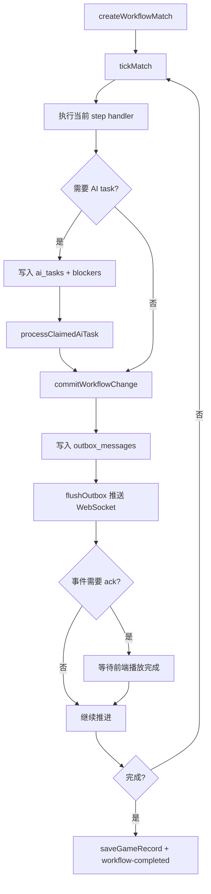

# 游戏工作流与 AI 调度

## 项目概述

游戏工作流是服务端最复杂的部分，负责把辩论赛、狼人杀等游戏拆成可持久化、可调试、可重放的步骤，并通过 WebSocket 按播放节奏推送给 C 端。

## 技术栈

- TypeScript
- ws WebSocket
- better-sqlite3 持久化
- zod schema
- OpenAI-compatible LLM 调用
- TTS 语音资源生成

## 目录结构

```txt
packages/server/modules/
├── game-socket/
│   ├── service.ts       # attachGameSocket、runSession、runner 选择
│   ├── session.ts       # send/sendAndWait/ack/pause/resume/skip
│   ├── sender.ts        # 事件准备、推送、音频资源维护
│   ├── replay.ts        # 历史对局回放
│   ├── narration.ts     # 事件旁白
│   ├── media.ts         # 媒体资源处理
│   ├── displayQueue.ts
│   └── constants.ts
├── workflow-engine/
│   ├── workflowRegistry.ts # workflow 和 step handler 注册
│   ├── service.ts          # match、tick、AI task、pending action、interrupt
│   ├── tick.ts             # 推进当前 match step
│   ├── repository.ts       # workflow 数据读写
│   ├── aiTaskWorker.ts     # AI task 执行
│   ├── effects.ts          # effect 与 interrupt
│   ├── projection.ts       # 状态投影
│   ├── routes.ts
│   └── controller.ts
├── debate/
│   ├── workflow.ts
│   ├── service.ts
│   ├── phases.ts
│   ├── skillRegistry.ts
│   ├── roleSkills.ts
│   ├── playerAgent.ts
│   ├── prompts.ts
│   ├── report.ts
│   └── speech.ts
├── werewolf/
│   ├── workflow.ts
│   ├── runtime.ts
│   ├── steps.ts
│   ├── actionWindows.ts
│   ├── actionPhases.ts
│   ├── aiActions.ts
│   ├── reducers.ts
│   ├── effects.ts
│   ├── presentation.ts
│   ├── channelRouter.ts
│   ├── views/
│   ├── handlers/
│   ├── prompts/
│   ├── roles.ts
│   ├── roleSkills.ts
│   ├── sheriffWorkflow.ts
│   ├── winCheck.ts
│   └── wolfTeam.ts
├── agent-core/
│   ├── playerAgent.ts
│   ├── gameAgent.ts
│   ├── skillRegistry.ts
│   ├── skillExecutor.ts
│   ├── roleSkillRegistry.ts
│   ├── skillEventEmitter.ts
│   └── fallbackAudit.ts
├── llm/
├── tts/
├── game-memory/
└── games/
```

## 架构设计

工作流核心对象是一局 `match`：

- `matches` 保存当前状态、step、版本、blockers、错误。
- `workflow_events` 保存事件流。
- `ai_tasks` 保存待执行 AI 任务。
- `pending_actions` 保存等待提交的行动。
- `outbox_messages` 保存待推送给前端的消息。
- `match_snapshots` 保存状态快照。

推进模型：



## 核心模块

### game-socket

- `attachGameSocket(server)`：把 WebSocketServer 挂到 HTTP server。
- `runSession`：根据首包启动真实游戏或回放。
- `getRequestConfig`：解析玩家、主持人、模式和模型 key 状态。
- `getRunner`：按 `gameType` 选择辩论赛或狼人杀 runner。
- `GameSession`：封装 `send`、`sendAndWait`、`resolveAck`、`pause`、`resume`、`skipCurrentPhase`。
- `sender`：准备事件、维护音频资源并推送给前端。
- `replay`：读取历史对局并按事件节奏回放。

### workflow-engine

- `workflowRegistry`：注册 workflow 和 step handler。
- `service`：创建 match、推进 tick、领取/完成 AI task、提交 pending action、创建/解决 interrupt、查询 debug state 和 outbox。
- `tick`：执行当前 step handler 并移动 workflow 状态。
- `repository`：读写 match、event、task、pending action、outbox 等。
- `aiTaskWorker`：执行已领取 AI task。
- `effects`：管理工作流效果和 interrupt。
- `projection`：生成前端或调试所需状态投影。

### 辩论赛流程

入口：

- `packages/server/aiDebateRunner.ts`
- `packages/server/modules/debate/workflow.ts`

工作流 ID：

- `debate.workflow.v1`

主流程：公布辩题 -> 正反方立论 -> 多轮攻辩 -> 双方总结 -> 评委点评和投票 -> MVP 投票 -> 公布结果。

关键机制：

- `createDebateWorkflowMatch` 创建 match 和初始辩论状态。
- 每个 AI turn 生成 `ai_tasks`。
- `executeSkillWithTrace` 调用辩论技能。
- `validateAiResult` 校验 AI 输出。
- `applyAiTurnResult` 把 AI 输出写入 phase、speech、winner、mvp。
- `serializeDebateState` 输出前端可展示状态。

### 狼人杀流程

入口：

- `packages/server/modules/werewolf/workflow.ts`
- `packages/server/modules/werewolf/runtime.ts`

工作流 ID：

- `werewolf.workflow.basic.v1`

主流程：分配身份 -> 按天循环夜晚行动和白天发言投票 -> 首日可进入警长竞选 -> 夜间结算、放逐结算和胜负检查 -> 结束归档。

关键机制：

- `createWerewolfSteps()` 根据最大天数生成流程。
- `createInitialWerewolfState` 根据模式展开角色槽、随机分配身份、创建 agent。
- `createRuntime` 从 match/state 恢复 agent、技能注册和上下文。
- action window step 创建 AI 行动窗口或 pending action。
- 夜间结算、放逐结算、胜负检查由服务端规则处理。
- `serializeWerewolfState` 输出前端可展示状态。
- 视角投影避免普通视角看到隐藏身份和私密信息。

### agent-core

- `playerAgent`：玩家 agent。
- `gameAgent`：游戏 agent。
- `skillRegistry`：技能注册。
- `skillExecutor`：技能执行。
- `roleSkillRegistry`：按角色应用技能。
- `fallbackAudit`：记录兜底行为。

## WebSocket 协议与数据流

前端首包：

```ts
type GameSocketStartPayload = {
  type: 'start';
  mode: 'real';
  gameType: string;
  playerIds?: number[];
  hostId?: number | string;
  topic?: unknown;
  debateTeams?: unknown;
  werewolfMode?: string;
  clientViewMode?: string;
  replayView?: boolean;
  replayGameId?: string;
};
```

ack 流程：

1. 服务端发送事件。
2. 如果事件需要等待播放，`sendAndWait` 注入 `ackId`。
3. 前端更新界面并播放语音/字幕。
4. 前端发送 `ack`。
5. 服务端继续推进。

控制消息支持：

- `pause`
- `resume`
- `skip-phase`

## 配置与部署

工作流依赖服务端启动：

```bash
pnpm run dev:server
pnpm run test:workflow
```

调试 API 挂载在 `/api/admin` 下：

- `GET /workflow/matches/:matchId/debug`
- `POST /workflow/matches/:matchId/tick`
- `POST /workflow/matches/:matchId/actions/:actionId/submit`
- `POST /workflow/ai-tasks/:taskId/retry`
- `POST /workflow/ai-tasks/:taskId/cancel`
- `POST /workflow/ai-tasks/:taskId/manual-complete`
- `POST /workflow/matches/:matchId/interrupts`
- `POST /workflow/interrupts/:interruptId/resolve`

## 扩展点与注意事项

- 新增游戏优先新增独立 workflow，并在 `game-socket` runner 分发中接入。
- 所有可持久化流程变化都要考虑 event、snapshot、outbox 和回放兼容性。
- AI 输出必须校验，不允许直接信任模型返回。
- 需要等待前端播放的事件必须使用 ack，避免服务端推进过快。
