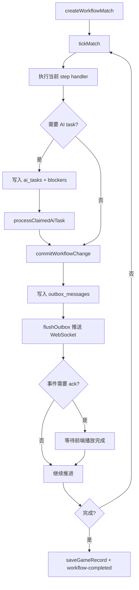

# 游戏工作流与 AI 调度

## 项目概述

游戏工作流是服务端最复杂的部分，负责把辩论赛、狼人杀等游戏拆成可持久化、可调试、可重放的步骤，并通过 WebSocket 按播放节奏推送给 C 端。

## 技术栈

- TypeScript
- ws WebSocket
- better-sqlite3 持久化
- zod schema
- OpenAI-compatible LLM 调用
- TTS 语音资源生成

## 目录结构

```txt
packages/server/modules/
├── game-socket/
│   ├── service.ts       # attachGameSocket、runSession、runner 选择
│   ├── session.ts       # send/sendAndWait/ack/pause/resume/skip
│   ├── sender.ts        # 事件准备、推送、音频资源维护
│   ├── replay.ts        # 历史对局回放
│   ├── narration.ts     # 事件旁白
│   ├── media.ts         # 媒体资源处理
│   ├── displayQueue.ts
│   └── constants.ts
├── workflow-engine/
│   ├── workflowRegistry.ts # workflow 和 step handler 注册
│   ├── service.ts          # match、tick、AI task、pending action、interrupt
│   ├── tick.ts             # 推进当前 match step
│   ├── repository.ts       # workflow 数据读写
│   ├── aiTaskWorker.ts     # AI task 执行
│   ├── effects.ts          # effect 与 interrupt
│   ├── projection.ts       # 状态投影
│   ├── routes.ts
│   └── controller.ts
├── game-engine/
│   ├── engine/             # GameEngine、definition registry、invariant checker
│   ├── workflow/           # workflow-engine facade
│   ├── action-window/      # ActionWindow 生命周期和提交校验
│   ├── agent/              # AgentRuntime contract
│   ├── skill/              # SkillRegistry contract
│   ├── effect/             # EffectQueue、EffectResolver
│   ├── event/              # DomainEvent EventBus
│   ├── channel/            # ChannelSystem 可见性校验
│   └── state/              # MatchStateStore 与 SQLite adapter
├── debate/
│   ├── workflow.ts
│   ├── service.ts
│   ├── phases.ts
│   ├── skillRegistry.ts
│   ├── roleSkills.ts
│   ├── playerAgent.ts
│   ├── prompts.ts
│   ├── report.ts
│   └── speech.ts
├── werewolf/
│   ├── workflow.ts
│   ├── runtime.ts
│   ├── steps.ts
│   ├── actionWindows.ts
│   ├── actionPhases.ts
│   ├── aiActions.ts
│   ├── reducers.ts
│   ├── effects.ts
│   ├── presentation.ts
│   ├── channelRouter.ts
│   ├── views/
│   ├── handlers/
│   ├── prompts/
│   ├── roles.ts
│   ├── roleSkills.ts
│   ├── sheriffWorkflow.ts
│   ├── winCheck.ts
│   └── wolfTeam.ts
├── agent-core/
│   ├── playerAgent.ts
│   ├── gameAgent.ts
│   ├── skillRegistry.ts
│   ├── skillExecutor.ts
│   ├── roleSkillRegistry.ts
│   ├── skillEventEmitter.ts
│   └── fallbackAudit.ts
├── llm/
├── tts/
├── game-memory/
└── games/
```

## 架构设计

工作流核心对象是一局 `match`：

- `matches` 保存当前状态、step、版本、blockers、错误。
- `workflow_events` 保存事件流。
- `ai_tasks` 保存待执行 AI 任务。
- `pending_actions` 保存等待提交的行动。
- `outbox_messages` 保存待推送给前端的消息。
- `match_snapshots` 保存状态快照。

推进模型：



## 核心模块

### game-socket

- `attachGameSocket(server)`：把 WebSocketServer 挂到 HTTP server。
- `runSession`：根据首包启动真实游戏或回放。
- `getRequestConfig`：解析玩家、主持人、模式和模型 key 状态。
- `getRunner`：按 `gameType` 选择辩论赛或狼人杀 runner。
- `GameSession`：封装 `send`、`sendAndWait`、`resolveAck`、`pause`、`resume`、`skipCurrentPhase`。
- `sender`：准备事件、维护音频资源并推送给前端。
- `replay`：读取历史对局并按事件节奏回放。

### workflow-engine

- `workflowRegistry`：注册 workflow 和 step handler。
- `service`：创建 match、推进 tick、领取/完成 AI task、提交 pending action、创建/解决 interrupt、查询 debug state 和 outbox。
- `tick`：执行当前 step handler 并移动 workflow 状态。
- `repository`：读写 match、event、task、pending action、outbox 等。
- `aiTaskWorker`：执行已领取 AI task。
- `effects`：管理工作流效果和 interrupt。
- `projection`：生成前端或调试所需状态投影。

### game-engine

`game-engine` 是通用 AI 玩家游戏引擎骨架，当前作为 `workflow-engine` 之上的内部 facade 使用，暂不替换现有狼人杀和辩论赛主流程。

- `GameEngine`：注册 `GameDefinition`、创建 match、tick、提交 action、解析 pending effect，并提供 `getDebugState(matchId)`。
- `WorkflowRuntime`：包装现有 `workflow-engine` 创建和推进能力，避免第一阶段重写 tick。
- `ActionWindowManager`：校验 ActionWindow 是否存在、是否打开、actor/actionType 是否合法。
- `EffectQueue`：把合法 `DomainAction` 转为 `WorkflowEffect` 并写入队列。
- `EffectResolutionService`：通过 resolver 把 effect 结算为 `DomainEvent`，再按游戏定义的 `projectState` 投影回 match state。
- `ChannelSystem`：校验所有 `DomainEvent` 必须声明 channel，`scope` event 必须声明 `scopeKey`。
- `InvariantChecker`：聚合 debug state 中的 channel、effect lifecycle、重复 idempotencyKey 等不变量问题。
- `MatchStateStore`：隔离 core 与 SQLite 细节，SQLite adapter 复用现有 `matches`、`pending_actions`、`workflow_effects`、`workflow_events`。

当前狼人杀 adapter 只迁移低风险动作：

- `wolf_vote` / `wolf_kill` -> `kill` effect -> `wolf_target_selected` wolves scope event -> 更新 `round.night.wolfChoices / wolfVoteTally / wolfTarget / wolfStrategy`。
- `seer_check` -> `inspect` effect -> `seer_checked` scope event -> 更新 `round.night.seerCheck` 和预言家玩家记录。
- `guard_protect` -> `protect` effect -> `guard_protected` scope event -> 更新 `round.night.guardTarget` 和守卫玩家记录。
- `witch_save` -> `save` effect -> `witch_saved` scope event -> 更新 `round.night.witchSave / witchSaveTarget` 和女巫解药使用状态。
- `witch_poison` -> `poison` effect -> `witch_poisoned` scope event -> 更新 `round.night.witchPoisonTarget` 和女巫毒药使用状态。

狼队刀口 event 是 `scope: wolves`，只表达狼队内部目标选择，不公开给普通观众，也不直接造成死亡。
女巫相关 event 仍是 `scope: witch`，不会公开给普通观众；公开死亡结算仍由现有夜间结算流程处理。

女巫夜间行动资格按药瓶独立计算：

- `witch_save` 仅在女巫存活、解药未使用且当晚存在狼刀目标时打开；只有此时女巫 prompt 和私密展示事件才能携带刀口。
- 解药已使用或平安夜时，解药 step 直接完成，不创建 action window，也不产生 C 端唤醒、结果或跳过展示。
- `witch_poison` 只依赖女巫存活、毒药未使用及 `onePotionPerNight` 限制，不因解药耗尽而失效，且其提示不得携带 `wolfTarget`。
- 两瓶药均耗尽或女巫已出局时，两个固定 workflow step 都静默跳过；跳过原因只写入 `channel: system` 的审计事件。
- `EventDeliverySubscriber` 不向实时播放回调交付 system channel，确保内部跳过和审计不会进入精确回放事件。

夜间死亡结算已新增旁路 resolver：

- `night_resolution` effect -> `night_resolved` public event，只公开 `day/deaths/message`。
- 同一 resolver 额外产出 `night_resolution_audited` system event，记录内部输入、effects 和死亡明细，供 debug 使用。
- `night_resolved` 可投影 `round.night.deaths`、`nightRevealed`、`publicSummary` 和死亡玩家状态。

Shadow audit 接入方式：

- `werewolf.night_resolve` 仍以 legacy `resolveNightEffects` 作为真实结算主路径。
- handler 在 legacy 结算前克隆输入 state，结算后调用 Engine Core `resolveEngineNightResolution` 做旁路对比。
- 对比结果写入 `werewolf_night_resolution_shadow_audited` system event，包含 `matched / mismatched / audit_failed` 状态。
- shadow audit event 必须使用 `visibility: system`，只供 debug/invariant 使用，不进入 C 端 outbox。
- B 端 `WorkflowDebugConsole` 会从 debug API 的 `events` 中汇总展示 shadow audit 结果，便于确认真实对局是否长期 matched。

旁路 resolver 暂不接管真实 `werewolf.night_resolve` handler，避免同时改动猎人开枪窗口、胜负检查、trace 快照和 C 端播放链路。

### 辩论赛流程

入口：

- `packages/server/aiDebateRunner.ts`
- `packages/server/modules/debate/workflow.ts`

工作流 ID：

- `debate.workflow.v1`

主流程：公布辩题 -> 正反方立论 -> 多轮攻辩 -> 双方总结 -> 评委点评和投票 -> MVP 投票 -> 公布结果。

关键机制：

- `createDebateWorkflowMatch` 创建 match 和初始辩论状态。
- 每个 AI turn 生成 `ai_tasks`。
- `executeSkillWithTrace` 调用辩论技能。
- `validateAiResult` 校验 AI 输出。
- `applyAiTurnResult` 把 AI 输出写入 phase、speech、winner、mvp。
- `serializeDebateState` 输出前端可展示状态。

### 狼人杀流程

入口：

- `packages/server/modules/werewolf/workflow.ts`
- `packages/server/modules/werewolf/runtime.ts`

工作流 ID：

- `werewolf.workflow.basic.v1`

主流程：分配身份 -> 按天循环夜晚行动和白天发言投票 -> 首日可进入警长竞选 -> 夜间结算、放逐结算和胜负检查 -> 结束归档。

关键机制：

- `createWerewolfSteps()` 根据最大天数生成流程。
- `createInitialWerewolfState` 根据模式展开角色槽、随机分配身份、创建 agent。
- `createRuntime` 从 match/state 恢复 agent、技能注册和上下文。
- action window step 创建 AI 行动窗口或 pending action。
- 夜间结算、放逐结算、胜负检查由服务端规则处理。
- `serializeWerewolfState` 输出前端可展示状态。
- 视角投影避免普通视角看到隐藏身份和私密信息。

### agent-core

- `playerAgent`：玩家 agent。
- `gameAgent`：游戏 agent。
- `skillRegistry`：技能注册。
- `skillExecutor`：技能执行。
- `roleSkillRegistry`：按角色应用技能。
- `fallbackAudit`：记录兜底行为。

## WebSocket 协议与数据流

### 狼人杀统一播放事件管线

狼人杀实时播放和新对局回放共用
`PlaybackEventSource -> PlaybackPipeline -> DisplayQueue -> WebSocket`：

- 实时 EventBus 事件经现有视角投影后进入 `PlaybackPipeline`。
- 展示事件完成旁白和媒体准备后、发送 ACK 前转换为 `PlaybackEvent`。
- 对局完成时，游戏快照与完整播放事件在同一事务中保存。
- 新对局回放按序发送已保存的最终展示载荷，不重新生成文案或音频。
- 每次实时播放或回放仍使用独立 WebSocket 连接和独立 ACK 序列。
- 播放事件绑定原始 `clientViewMode`，回放不能切换为其他视角。
- 没有播放事件记录的旧对局继续由 `replay.ts` 根据快照重建。

前端首包：

```ts
type GameSocketStartPayload = {
  type: 'start';
  mode: 'real';
  gameType: string;
  playerIds?: number[];
  hostId?: number | string;
  topic?: unknown;
  debateTeams?: unknown;
  werewolfMode?: string;
  clientViewMode?: string;
  replayView?: boolean;
  replayGameId?: string;
};
```

ack 流程：

1. 服务端发送事件。
2. 如果事件需要等待播放，`sendAndWait` 注入 `ackId`。
3. 前端更新界面并播放语音/字幕。
4. 前端发送 `ack`。
5. 服务端继续推进。

控制消息支持：

- `pause`
- `resume`
- `skip-phase`

## 配置与部署

工作流依赖服务端启动：

```bash
pnpm run dev:server
pnpm run test:workflow
```

调试 API 挂载在 `/api/admin` 下：

- `GET /workflow/matches/:matchId/debug`
- `POST /workflow/matches/:matchId/tick`
- `POST /workflow/matches/:matchId/actions/:actionId/submit`
- `POST /workflow/ai-tasks/:taskId/retry`
- `POST /workflow/ai-tasks/:taskId/cancel`
- `POST /workflow/ai-tasks/:taskId/manual-complete`
- `POST /workflow/matches/:matchId/interrupts`
- `POST /workflow/interrupts/:interruptId/resolve`

## 扩展点与注意事项

- 新增游戏优先新增独立 workflow，并在 `game-socket` runner 分发中接入。
- 所有可持久化流程变化都要考虑 event、snapshot、outbox 和回放兼容性。
- AI 输出必须校验，不允许直接信任模型返回。
- 需要等待前端播放的事件必须使用 ack，避免服务端推进过快。

## Werewolf interaction feedback trace

狼人杀角色交互在行动结果生效后，会记录内部 trace 事件 `werewolf_interaction_feedback`。该事件只用于 B 端观测，不作为 C 端 socket/display 事件。

覆盖行动：

- `seer_check`：`scope: seer`，记录查验目标和阵营结果。
- `guard_protect`：`scope: guard`，记录守护目标。
- `witch_save`：`scope: witch`，仅在解药可用时记录是否使用解药、救人目标和狼刀目标。
- `witch_poison`：`scope: witch`，记录是否使用毒药和毒杀目标。
- `hunter_shot`：`public`，记录开枪目标和触发原因。

预言家、守卫、女巫的私密阶段结果必须使用行动对应的 scope channel，不允许发布为 `public`。

`createWerewolfEvent` 会统一经过狼人杀 channel guard。包含私密结果的 `werewolf_phase_result` 和私密行动完成事件会被强制修正为对应 `scope/scopeKey`，并在 payload 中附带 `channelInvariantIssues` 供 debug 追踪。公开阶段提示可以继续使用 `public`，但不得携带查验、守护、用药等私密结果字段。

预言家查验结果在 `seer_check` 生效后会写入预言家玩家记录的 `seerChecks`。后续每次从持久化状态重建 `PlayerAgent` 时，runtime 会把这些记录追加为预言家的私密 system message，例如 `【预言家私密查验结果】第1晚，你查验了2号，结果是：好人。`。因此后续 `day_speech`、`day_vote` 和下一晚行动的 LLM 请求都会带上该玩家自己的查验记忆；普通 public/C 端事件不得携带该私密结果。B 端 TraceExplorer 可在“关键事件”中查看 `werewolf_interaction_feedback`，不要只依赖 LLM 调用列表判断角色反馈是否发生。

狼人杀夜间 action window 已接入 Engine Core bridge。`wolf_vote / wolf_kill / seer_check / guard_protect / witch_save / witch_poison` 完成后，状态写入优先复用 `GameDefinition.createEffectsFromAction`、effect resolver 和 `projectState`。由于当前 workflow handler 仍是同步接口，bridge 以同步方式调用狼人杀 definition/resolver；真实 `GameEngine.submitAction()/resolveEffects()` 的异步 API 暂不直接在 handler 内调用，避免与 `tick` 外层 workflow event commit 产生双写竞争。

每次 bridge 执行都会生成 `werewolf_action_engine_shadow_audited` system event，对比 legacy reducer 与 Engine Core 投影的关键夜间字段。`matched` 表示新旧一致；`mismatched` 只记录差异，不阻断对局；`audit_failed` 会 fallback 到 legacy reducer。

狼队 AI 的私密系统提示会包含狼队友座位号和状态，例如 `2号（狼人，存活）`、`3号（狼人，已出局）`。该信息只进入狼队玩家自己的 LLM prompt，用于夜间协作和白天发言推理；已出局狼队友必须被标识为已出局，避免 AI 继续把其当作可参与夜间决策的存活队友。

预言家查验完成后，除了写入 `seerChecks` 私密记忆和 `werewolf_interaction_feedback` trace，还会向 EventBus 双写 `seer-check` 事件。该事件必须保持 `channel: scope`、`scopeKey: seer`，payload/message 可以包含查验目标和结果，用于预言家私有反馈；不得改成 `public`，避免普通观众看到查验结果。

## Werewolf dynamic prompt context

狼人杀 AI 使用“完整开局一次 + 持久会话 + 动态增量上下文”。每次行动由 `prompts/context.ts` 生成 prompt bundle，包含 `systemRules / publicFacts / privateKnowledge / recentContext / taskInstruction / outputContract`，再通过普通 `askText / askJson / askVoteTarget` 写入当前玩家会话。会话按 `werewolf + matchId + sourcePlayerId` 保存到 `memory_snapshots`，裁剪后保留开局 system、结构化摘要和最近 12 组原始对话。

公开事实必须从完整 `state.rounds` 聚合，而不是只看当前 round。后续任意发言、投票、夜间行动 prompt 都应同步夜晚死亡、白天放逐出局、白痴翻牌、猎人开枪、警长结果、警徽流转、最近一次已完成的白天放逐票型、当前存活/已出局名单。放逐票型需要列出每位玩家投给谁，弃票显示为“X号弃票”；进入下一天后仍对所有合法玩家可见。白天放逐后，该玩家不能再出现在合法投票目标中。

私密信息只进入对应玩家的 prompt：狼人看到狼队友座位号和存活/已出局状态，预言家只看到自己的 `seerChecks`，女巫只看到自己的用药状态，守卫只看到自己的守护状态。非对应角色不得收到这些私密反馈。

女巫刀口属于有条件的私密信息：仅构建可执行的 `witch_save` prompt 时注入。解药已使用后，即使毒药仍在，后续 `witch_poison` prompt 也只能包含药品状态和合法毒杀目标，不得读取或描述当晚狼刀目标。

狼人杀和辩论赛会在开局 prompt 中注入当前参赛玩家的跨局聚合画像。画像按 `gameType + ownerPlayerId + subjectPlayerId` 隔离，只学习公开行为、比赛结果和赛后公开身份；不保存狼聊、查验、用药等局中私密过程。至少共同参赛两局后才达到首版注入阈值；每名对手最多两条特征，单条约 100 字，总长度硬限制约 1200 字，并明确标注为历史印象而非本局身份判断。

## Werewolf EventBus 展示字段约定

狼人杀 EventBus 交付到 C 端前会在 `eventDeliverySubscriber.ts` 扁平化关键展示字段：

- `vote-result` 必须保留 `votes/tally/exile`，并尽量携带结算后的 `game` 和最新 `round`，用于 C 端展示玩家投票箭头/角标和放逐结果。
- 警长事件必须保留 `sheriffElection/sheriffId/sheriffTransfer`，用于 C 端持续展示警徽、警长候选人和警徽流转。
- `wolf-vote` 完成事件携带动作后快照及 `wolfTarget/wolfChoices/wolfVoteTally`，保持 `scope: wolves`。
- `seer-check` 完成事件携带动作后快照及 `seerCheck: { target, result }`，保持 `scope: seer`。
- `witch-action` 毒药完成事件携带动作后快照及 `witchAction: { use, target, reason }`，保持 `scope: witch`；`use` 仅在严格等于 `true` 时视为用毒。
- 这些字段属于展示状态，不改变 HTTP API 或数据库；C 端会与本地已知 `game.rounds` 做合并，而不是直接覆盖完整状态。

死亡结算按“死亡技能 -> 警徽处置 -> 胜负检查”继续执行。死亡警长通过 `sheriff_badge_disposition` 行动窗决定移交或撕毁；AI 失败、非法目标或无存活目标时降级为撕毁。处置会更新 `sheriffId/sheriffBadge/sheriffTransfers`，并发布公开的 `sheriff-badge-transfer` 或 `sheriff-badge-tear`，同一死亡警长只处理一次。

白天正式发言前执行 `sheriff_speech_direction`：

- 当前有效警长存活时，由警长选择 `clockwise/counterclockwise`，从该方向的下一名存活玩家开始，警长最后发言。
- 警长方向非法或 AI 失败时随机降级，并将结果写入 `round.daySpeech`。
- 无警长且有夜间死亡时，以最后播报的死者为基准，从顺时针后置位开始；平安夜随机起点并顺时针发言。
- 当前警长从历史回合和 `sheriffTransfers` 解析，支持跨天及警徽移交。

所有实际出局入口按“死亡技能 -> 警徽处置 -> 遗言 -> 胜负检查”执行。夜间有效狼人击杀会先基于“只应用该狼人击杀后的中间阵容”检查狼人胜利；若已满足当前模式的狼人胜利条件，则在当前 round 写入内部 `winnerLock`。同夜毒药、猎人开枪、警徽流和遗言继续执行，但最终胜负不得覆盖该狼人锁定结果。被守护或解药抵消的狼刀不会建立锁定。`winnerLock` 仅用于服务端工作流，不进入 C 端快照。

死亡链编排位于 `packages/server/modules/werewolf/deathResolution/`：

- `service.ts` 统一循环推进猎人、警徽、遗言和胜负阶段；各阶段只返回 `waiting/advanced/idle`，不得互相递归调用。
- `hunterStage.ts`、`sheriffBadgeStage.ts`、`lastWordsStage.ts` 分别管理对应 action window 和结果落盘。
- `types.ts` 定义内部上下文与 `round.deathResolution` 检查点。检查点记录来源、step、初始 effect、已完成 actor 和最终状态，序列化及视角投影时移除。
- 旧状态没有检查点时，根据 `nightRevealed/exile/idiotReveal/currentActionWindow` 恢复，不重复应用初始死亡效果。
- 多猎人使用 actor 级内部工作键隔离 AI task/pending action，但公开 action window 和事件仍保持 `hunter_shot`。
- workflow 事件按猎人 actor、死亡警长、遗言来源与玩家设置幂等键；初始 effect 使用稳定 ID。放逐 `vote-result` 由检查点保证恢复执行时不重复发布，比赛结束事件按 step 去重。

警长投票资格由服务端在 actor 选择和结果落盘两层校验。首投排除当前候选人与 `withdrawnIds`，复投排除复投候选人与 `withdrawnIds`；旧 pending action 或伪造提交不会进入 `voters/votes/tally`。

遗言使用内部 `last_words` 有序 action window。白天只有实际被放逐者发表 `exile-words`，白痴翻牌、平票和放逐后猎人带走者不创建放逐遗言。第 1 夜所有实际死亡玩家按死亡发生顺序发表 `last-words`，包括毒杀与猎人连锁带走；第 2 夜起不创建夜死遗言。内部 `pendingLastWords` 只用于断点恢复，序列化和视角投影时移除。

胜负判断只使用当前实际存活阵容：狼人全灭时好人胜利；`side` 为平民或神职任一边归零，`gods` 为神职归零，`villagers` 为平民归零，`all` 为所有好人归零。取消天亮票权比较和放逐后“下一刀必胜”推演；旧 `single` 配置读取时映射为 `side`。

存活阵容由统一评估器分类并统计狼人、神职、平民和好人总数。标准 `roleType` 优先；历史快照缺失或异常时，按角色 ID、阵营和角色技能降级分类，猎人、女巫、预言家、守卫和白痴均计入神职，任何存活好人都必须归入神职或平民。狼刀优先锁定会保存触发瞬间的阵容统计和胜利模式，死亡链最终阶段只接受能够由该统计重新验证的狼人胜利锁；缺少阵容证据的旧锁不再直接结束尚未完成的对局。
