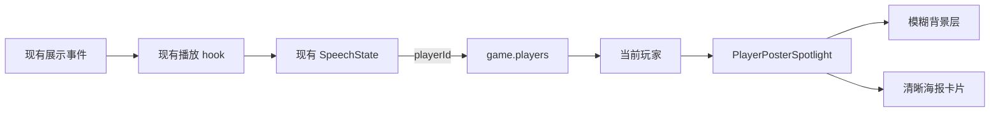

# v2 玩家发言海报聚光设计

## 目标与范围

为当前 13 位启用玩家制作统一的高清角色海报，并在 v2 辩论、狼人杀、谁是卧底页面中，于玩家发言期间显示对应海报，使观众能立即识别发言者。

范围仅包含 `/game/v2/debate`、`/game/v2/werewolf`、`/game/v2/undercover`。旧版 `/games/*` 页面、主持人播报、服务端事件、TTS、ACK、REST API、数据库和共享协议不变。

## 第一性设计结论

全屏替换会削弱座位、阶段和字幕信息，只显示卡片又缺少舞台氛围，因此采用“同一张海报双层复用”的混合聚光方案：低透明度放大海报作为背景染色，清晰海报卡片作为发言者主视觉。现有游戏信息始终位于海报之上。

## 海报资产

- 玩家：豆包、Grok、文心一言、Gemini、Kimi、DeepSeek、千问、元宝、讯飞星火、智谱清言、ChatGPT、Claude Code、Meta。
- 每位玩家一张无文字竖版海报，采用统一 4:5 构图。
- 延续已批准三视图中的人物身份、性别、发型、服装、主色和胸前抽象纹样。
- 风格保持精致柔和的 3D Q 版动画渲染，角色以半身至膝上为主，面向镜头，表情贴合人格但不过度夸张。
- 背景使用与角色主色协调的深色电影感渐变、柔和轮廓光和少量抽象粒子，主体与背景具有足够分离度。
- 不包含玩家姓名、品牌文字、企业 Logo、武器、水印、复杂道具或其他人物。
- 文件存放在 `packages/client/public/player-posters/`，以稳定英文短名命名，例如 `doubao.webp`、`grok.webp`、`claude-code.webp`。
- 原始 PNG 保留在 `artifacts/player-posters/`；客户端使用经过尺寸与体积优化的 WebP。缺失资源不得阻断游戏。

## 客户端结构

新增共享展示组件 `packages/client/src/components/PlayerPosterSpotlight/`，职责仅包括：

- 根据传入玩家解析海报路径。
- 渲染模糊背景层、清晰海报卡片、玩家名称和“正在发言”状态。
- 处理淡入淡出、资源加载失败和 `prefers-reduced-motion`。
- 不读取 WebSocket、不控制 TTS、不发送 ACK、不推断游戏规则。

海报路径映射使用一个客户端常量表，键为玩家规范化名称，值为静态 WebP 路径。未知玩家或加载失败时回退到玩家现有头像；头像也不存在时只显示游戏原有渐变背景和姓名。

## 数据流

发言者唯一来源仍是现有公开播放状态：辩论与狼人杀使用当前 `SpeechState.playerId`；谁是卧底使用公开状态中当前轮最后一条有效发言的 `playerId`。实时与回放沿用同一最终展示状态。

## 三个 v2 页面行为

### 辩论

海报聚光位于中央舞台区域，正反方座位保持可见；字幕位于最上层。海报主色可随玩家变化，但不替换正反方阵营色。

### 狼人杀

海报聚光覆盖月夜/白天背景之上、座位与底部字幕栏之下。不得显示或推断玩家隐藏身份；只使用公开玩家姓名和外观资产。主持人、系统播报以及没有 `playerId` 的技能说明不显示玩家海报。

### 谁是卧底

海报卡片进入现有中央焦点区，六个座位继续显示；当前发言座位仍保留原有高亮。终局、投票和准备状态不显示海报。

## 动画与可访问性

- 发言开始和换人时使用约 220ms 的透明度与轻微缩放过渡，结束时淡出。
- 开启 `prefers-reduced-motion: reduce` 时取消位移和缩放，只保留即时透明度切换。
- 海报为辅助视觉，图片使用空替代文本；玩家姓名和“正在发言”由可读文本提供。
- 不新增自动聚焦，不改变键盘操作，不遮挡暂停、继续、跳过和语音开关。

## 错误与边界

- 玩家不存在、`playerId` 无效、海报缺失或图片加载失败：不渲染清晰海报，保留现有游戏 UI。
- 同一发言事件重复渲染：组件保持同一玩家，不重启动画或改变 ACK。
- 发言者切换：以最新公开 `playerId` 为准，旧海报立即进入退出过渡。
- 主持人或系统播报：不使用默认玩家海报。
- 海报加载只影响视觉，不得延迟字幕、语音播放或 ACK。

## 验收标准

- 13 张海报均能在 4:5 卡片和放大模糊背景两种用法下保持主体清晰。
- 三个 v2 页面在玩家发言时显示正确姓名与对应海报，主持人和非发言阶段不显示。
- 实时和回放行为一致；海报加载失败时游戏正常继续。
- 字幕、座位、阶段信息和控制区无遮挡；狼人杀不泄露隐藏身份。
- reduced-motion 生效；组件具备可读的发言者文本。
- 客户端类型检查、构建和相关单元测试通过。
