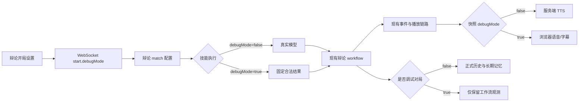

# 辩论赛调试模式设计

## 目标

为 C 端辩论赛增加与狼人杀一致的调试模式：不调用真实模型和服务端 TTS，使用固定合法结果快速跑通完整辩论流程。调试对局保留工作流观测数据，但不写入正式对局历史、精确回放或长期玩家记忆。

## 范围

本次包含：

- 在辩论赛开局设置中增加默认关闭的调试模式开关。
- 通过现有 WebSocket `start.debugMode` 字段传递调试状态。
- 在现有辩论技能执行边界生成固定发言、评委结果和 MVP 投票。
- 继续运行正式的 workflow、事件投影、前端播放和终局计算链路。
- 让辩论快照携带 `debugMode`，复用媒体层的服务端 TTS 跳过逻辑。
- 增加覆盖调试流程的最小测试，并同步项目文档。

本次不包含：

- 新增 Mock 模式、独立调试工作流或调试 Agent 抽象。
- 工作流断点、单步执行、状态编辑或后台调试控制台扩展。
- 保存调试对局、生成回放或写入长期玩家记忆。
- 新增 REST API、WebSocket 消息类型、数据库表或迁移。
- 根据任意自定义辩题动态生成调试文案。

## 架构

调试模式复用正式辩论工作流，只替换外部 AI 和服务端 TTS 依赖。

不创建独立 Mock runner。这样调试模式仍能覆盖正式的步骤顺序、任务校验、状态归并、胜负/MVP 计算、事件投影和前端 ACK 播放流程。

## 前端设计

辩论设置弹窗增加“调试模式”开关，行为与狼人杀开局设置保持一致：

- 默认关闭。
- 开启时显示“固定发言，浏览器语音”的说明。
- 开关只影响下一次新开局，不修改历史回放。
- 辩题、正反方阵容、评委、队长和主持人配置继续使用现有校验。

`DebateGame` 保存开关状态，并在调用现有 `startSession()` 时传入 `debugMode`。不增加新的 service 或 WebSocket 消息结构。

## 服务端设计

### 配置传播

辩论 runner 创建 match 时保留 `debugMode`。辩论状态序列化从 match 配置读取该值并输出到游戏快照，使现有媒体层能够识别调试对局并跳过服务端 TTS。

### 固定结果

调试结果在辩论技能执行边界生成，不修改 workflow handler 或结果校验器：

- 文本技能返回按阶段、阵营和辩位区分的固定短发言。
- 攻辩提问和回答保留合法的提问/回应结构。
- 评委点评返回现有 schema 接受的 `winner` 和 `text`。
- MVP 投票从现有合法候选中按稳定顺序选择，返回合法 `voterId/target`。

固定结果必须通过现有 `validateAiResult`。禁止为调试模式跳过输入校验、结果校验、步骤执行、事件生成或终局计算。

### 语音与保存

快照中的 `debugMode: true` 触发现有媒体逻辑，不解析玩家/主持人的服务端音色，也不生成云端音频。前端继续通过现有浏览器语音或字幕完成 ACK。

`game-socket` 已在 `config.debugMode` 为真时跳过 `saveGameRecord()`。因此调试对局不会进入：

- 最近对局和正式历史；
- 精确回放事件；
- 对局玩家快照；
- 跨局长期玩家记忆。

工作流 match、task、event、outbox 和 trace 等调试观测数据继续按现有保留策略处理。

## 错误处理

- `debugMode` 继续由现有 Zod WebSocket schema 校验为布尔值。
- 调试模式仍要求合法辩题、至少八名已分配辩手及有效阵容。
- 固定 MVP 目标必须来自当前合法候选列表；列表异常时应显式失败，不返回假成功。
- 正式模式不进入任何调试分支，模型调用、故障转移和 TTS 行为保持不变。
- 调试模式下的固定结果若不符合现有校验，应让工作流按现有错误路径失败，不能静默吞掉。

## 测试与验收

增加最小自动化检查：

1. 在没有可调用模型的条件下，以 `debugMode: true` 运行辩论工作流并完成。
2. 断言生成合法的阶段发言、评委结果、胜负和 MVP。
3. 断言输出游戏快照包含 `debugMode: true`。
4. 复用或扩展现有 game-socket 测试，断言调试对局不调用正式保存路径。
5. 断言 `debugMode: false` 仍走现有真实模型路径。

实施完成后运行：

- 客户端与服务端类型检查；
- 相关 unit 测试；
- 相关 workflow 测试；
- `git diff --check`。

## 预计文件影响

预计修改：

- 辩论开局设置组件：展示调试开关并上送状态。
- 辩论游戏容器：保存开关状态并传给 `startSession()`。
- 辩论 runner：把 `debugMode` 保留到 match 配置。
- 辩论技能注册：在现有技能边界生成固定合法结果。
- 辩论状态序列化：在游戏快照中公开调试标志。
- 相关 unit/workflow 测试。
- `docs/project-client.md`、`docs/project-workflow.md`，必要时补充 `docs/project-server.md`。

预计不新增业务模块或数据库迁移。若实施时发现现有文件已超过项目规定的职责或长度上限，再只拆出一个辩论专用固定结果工具文件；不预先创建抽象。

## 验收标准

- C 端辩论开局可开启或关闭调试模式，默认关闭。
- 开启后无需模型 API Key 即可完成完整辩论流程。
- 调试流程包含各正式阶段、评委结果、胜负和 MVP。
- 调试模式不发起真实 LLM 或服务端 TTS 请求。
- 调试对局不出现在最近对局、正式历史或长期玩家记忆中。
- 关闭调试模式后，正式辩论行为与当前版本一致。
