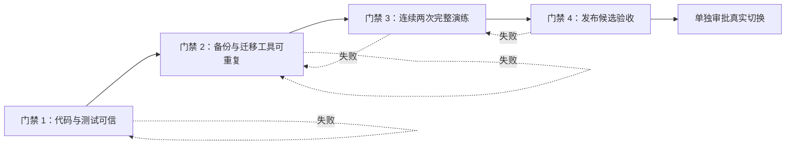

# PostgreSQL 生产上线准备设计

## 1. 目标

在不连接或修改真实生产 PostgreSQL 的前提下，把当前 PostgreSQL 迁移版本推进到“可以申请生产切换”的状态。完成标准包括代码与 CI 门禁、可重复运维工具、两次生产 SQLite 副本迁移演练、备份恢复演练和可审计发布报告。

真实生产切换不属于本阶段。它必须在本设计全部门禁通过后，使用独立维护窗口和单独授权执行。

## 2. 已确认约束

- 正式停机窗口可以是数小时至数天，不需要双写、CDC 或增量同步。
- PostgreSQL 16 独立部署，生产 Compose 不创建数据库服务。
- 旧 workflow 运行数据和旧观测历史不迁移。
- 图片、头像、上传文件和生成音频继续保存在文件系统。
- 正式目标必须是全新空库或全新空 schema，不合并已有数据。
- 本阶段允许新增可复用运维脚本，但默认行为必须是只读预检。
- 生产连接信息、生产目标库和真实流量不进入自动化测试或演练。
- 当前 Undercover 和既有文档未提交改动不在本阶段范围内。

## 3. 方案选择

采用顺序执行的分阶段上线门禁：

1. 代码、文档与测试可信。
2. 备份、迁移与验收工具可重复执行。
3. 使用同一生产 SQLite 只读副本完成两次独立演练。
4. 汇总发布候选证据并给出明确 PASS 或 FAIL。

不采用演练优先方案，因为首次演练会过度依赖人工步骤；不采用纯手册方案，因为它无法保证重复执行的一致性和审计性。

## 4. 门禁架构



任何门禁失败都阻止下一阶段。修复后必须从失败门禁重新执行，不能人工标记为通过。

## 5. 组件边界

### 5.1 CI 发布门禁

现有 `.github/workflows/deploy-master.yml` 拆成验证和部署两个 job。验证 job 启动 PostgreSQL 16 service，执行类型检查、生产构建、单元测试、工作流测试、迁移映射测试、PostgreSQL 集成测试和生产镜像检查。部署 job 依赖验证 job，只允许在 `master` push 且验证通过时执行。

Pull Request 只执行验证 job，不获取生产 SSH Secrets，也不执行部署。

### 5.2 运维命令

复用 `packages/db-migrator`，按职责增加：

```text
packages/db-migrator/src/
  commands/
    preflight.ts
    backup.ts
    rehearse.ts
    validate.ts
    release-readiness.ts
  reporting/
    reportTypes.ts
    reportWriter.ts
  cli.ts
```

- `preflight.ts`：检查 SQLite 来源、PostgreSQL 16、目标空库、TLS 配置、磁盘空间、工具版本和必需参数。
- `backup.ts`：使用 SQLite backup API 创建一致副本，同时归档源数据库及存在的 `-wal`、`-shm` 文件，复制资源目录并生成 SHA-256 manifest；不对源数据库执行 checkpoint 或写操作。
- `rehearse.ts`：创建本次演练的全新目标 schema，调用现有导入器并串联验收。
- `validate.ts`：校验行数、外键、JSON、时间、identity sequence 和核心业务样本。
- `release-readiness.ts`：汇总所有报告并计算最终 PASS 或 FAIL。
- `reportTypes.ts`：定义统一、可机器读取的报告类型。
- `reportWriter.ts`：脱敏并原子写入 JSON 和人类可读报告。

根目录脚本保持为薄入口：

```text
scripts/ops/postgres/
  preflight.ps1
  backup.ps1
  rehearse.ps1
  validate.ps1
  release-readiness.ps1
```

PowerShell 入口只处理参数、退出码和用户提示；数据库判断、校验规则和报告生成只在 TypeScript 中实现。

### 5.3 应用冒烟

冒烟测试使用演练目标启动临时应用实例，验证：

- `/api/toc/health` 执行真实 PostgreSQL 查询。
- 管理员登录、首次改密和配置 CRUD。
- 玩家、模型、语音、皮肤和狼人配置读取。
- 创建并完成一局可控调试对局。
- 历史详情和回放顺序。
- 长期记忆读取和更新。
- 终态对局删除清理关联游戏、回放、工作流和观测数据，同时保留跨局记忆。

冒烟测试不得调用真实付费 LLM 或 TTS；使用调试模式或明确的测试替身。

## 6. 数据流

```text
生产 SQLite 只读副本
  -> 一致性备份与 SHA-256 manifest
  -> 全新 PostgreSQL schema
  -> 一次性 SQLite 导入器
  -> 数据验收
  -> 临时应用冒烟
  -> 发布候选报告
```

两次演练使用同一个源副本和相同源 SHA-256，但使用不同目标 schema、不同 `runId` 和不同报告目录。第二次不得读取或修改第一次目标。

## 7. 报告模型

```ts
interface ReadinessReport {
  runId: string;
  stage: 'preflight' | 'backup' | 'import' | 'validation' | 'smoke' | 'release';
  status: 'passed' | 'failed';
  startedAt: string;
  finishedAt: string;
  durationMs: number;
  checks: Array<{
    id: string;
    status: 'passed' | 'failed' | 'skipped';
    expected?: string;
    actual?: string;
    message: string;
  }>;
  artifacts: Array<{
    type: 'backup' | 'manifest' | 'migration-report' | 'validation-report' | 'smoke-report';
    path: string;
    sha256?: string;
  }>;
  errors: Array<{ code: string; message: string }>;
}
```

报告不得包含数据库密码、API Key、JWT、管理员密码或完整数据库连接串。报告先写入同目录临时文件，完成后原子重命名。

## 8. 安全与失败策略

- 所有命令默认只读；创建备份、目录或 schema 必须显式传入 `--execute`。
- 目标业务表非空时立即拒绝导入。
- 任一强制检查失败时返回非零退出码，停止后续阶段。
- 只允许清理由当前 `runId` 创建且名称匹配演练前缀的 schema。
- 导入失败保留失败现场和报告，不把失败目标用于下一次演练。
- 缺少备份、manifest、迁移报告或验收报告时，不得生成最终 PASS。
- 回滚演练只验证备份可恢复、旧镜像可启动和检查清单完整，不自动切换真实流量。
- 脚本不提供生产 schema 自动删除、备份覆盖或真实流量恢复命令。

## 9. 测试策略

当前数据库迁移后遗留的 24 个 `test.skip` 必须分类处理：

- 认证、模型额度、回放和数据库状态测试迁入 `tests/postgres/`，使用独立临时 schema。
- 狼人 action bridge、prompt context 等可以注入存储的测试使用内存执行器。
- Undercover 完整工作流、回放和删除边界使用 PostgreSQL 集成环境。
- 被更高层测试完全覆盖的重复用例删除，不保留带误导性说明的 skip。
- 关键路径上线门禁不允许 `test.skip`；确有平台条件的非关键跳过必须提供机器可识别原因。

运维命令覆盖以下失败用例：

- 缺少来源文件、来源不可读或 SQLite integrity check 失败。
- 目标不是 PostgreSQL 16、TLS 要求不满足或目标非空。
- 备份空间不足、资源复制失败或 manifest 校验失败。
- 非法 JSON、非法时间、孤儿外键、重复执行和 sequence 错误。
- 报告写入中断、报告被篡改或两次演练源哈希不一致。
- 冒烟健康检查、登录、CRUD、对局、回放、记忆或删除边界失败。

## 10. 两次演练验收

两次演练必须同时满足：

- 使用同一生产 SQLite 只读副本及相同 SHA-256。
- 使用两个全新且互不复用的目标 schema。
- 所有导入表源行数、导入行数和目标行数一致。
- 无孤儿外键、非法 JSON、异常时间或错误 identity sequence。
- 管理员、配置、玩家、历史、回放和长期记忆抽样一致。
- workflow 和观测旧数据在报告中明确列为跳过。
- 第二次的数据结论与第一次一致。
- 记录每阶段耗时，正式维护窗口按较慢一次总耗时的两倍预留。

## 11. 最终发布门禁

只有以下条件全部成立，发布候选报告才能是 PASS：

- CI 全部通过。
- 关键数据库测试无 skip。
- 两次演练全部通过。
- SQLite、WAL 和资源备份恢复演练通过。
- 生产镜像确认不包含 SQLite 运行依赖。
- PostgreSQL TLS、最小权限、连接池和超时检查通过。
- 健康检查、认证、配置 CRUD、完整对局、历史回放、长期记忆和关联删除冒烟通过。
- 项目文档不再把 SQLite 或 JSON fallback 描述为生产运行路径。
- 上线负责人和回滚负责人完成书面确认。

## 12. 非目标

- 本阶段不执行真实生产切换。
- 不实现长期双写、增量同步或数据库合并。
- 不实现多应用实例所需的分布式 WebSocket 会话、全局登录限流或容量协调。
- 不迁移旧 workflow 和旧观测数据。
- 不顺带重构游戏规则、前端页面或无关模块。
